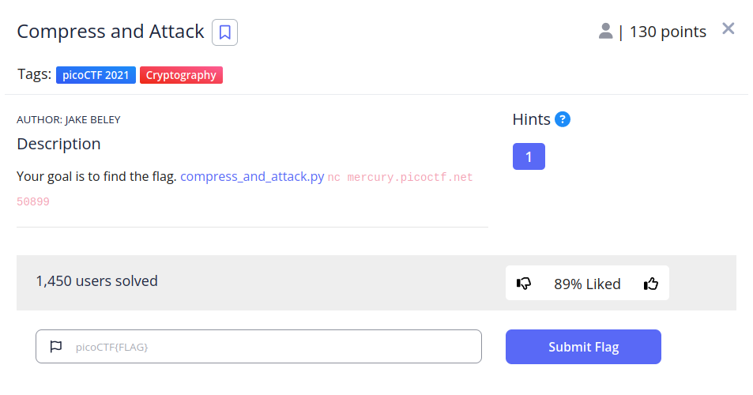
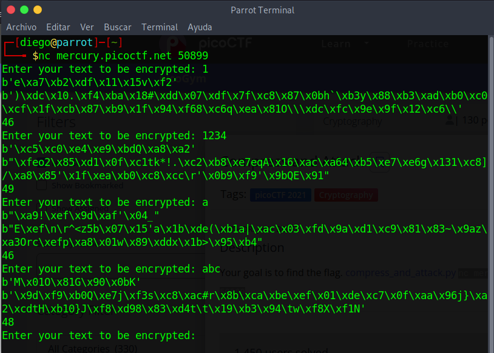
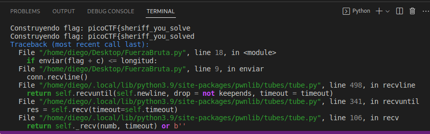
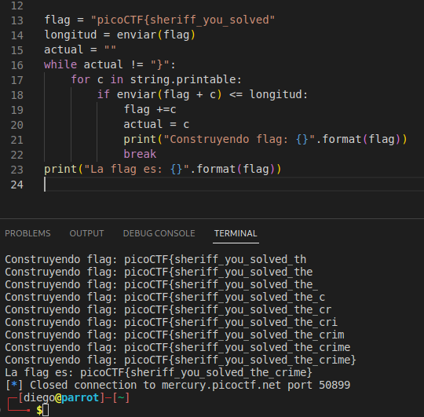

# Compress and Attack


## Descripción
Your goal is to find the flag. [compress_and_attack.py](https://mercury.picoctf.net/static/248c32b70ad86502fb4169ba915c09bc/compress_and_attack.py) nc mercury.picoctf.net 50899

## Resolucion
Al conectarnos por netcat obtenemos el siguiente mensaje:



Nos permite encriptar el mensaje que le proporcionemos. Vamos a observar el código:

```
#!/usr/bin/python3 -u

import zlib
from random import randint
import os
from Crypto.Cipher import Salsa20

flag = open("./flag").read()


def compress(text):
    return zlib.compress(bytes(text.encode("utf-8")))

def encrypt(plaintext):
    secret = os.urandom(32)
    cipher = Salsa20.new(key=secret)
    return cipher.nonce + cipher.encrypt(plaintext)

def main():
    while True:
        usr_input = input("Enter your text to be encrypted: ")
        compressed_text = compress(flag + usr_input)
        encrypted = encrypt(compressed_text)
        
        nonce = encrypted[:8]
        encrypted_text =  encrypted[8:]
        print(nonce)
        print(encrypted_text)
        print(len(encrypted_text))

if __name__ == '__main__':
    main()
```

Vemos que la flag se comprime junto con la cadena proporcionada. Para la compresión se usa zlib, es decir, es una compresión looseless (sin pérdida).

El hecho de que nuestro input se comprima con la flag es lo que usaremos para averiguarla.

Si el programa tiene que comprimir, por ejemplo, "aa" y "bb"; su longitud va a ser mayor que la compresión de "aa" y "aa".

Con fuerza bruta, y anotando la mejor compresión obtenida, podemos averiguar la flag.

Para ello realizaremos el siguiente script de python:

```
from pwn import *
import string

conn = remote("mercury.picoctf.net", 50899)

def enviar(input):
    conn.recvuntil("encrypted:")
    conn.sendline(input)
    conn.recvline()
    conn.recvline()
    return int(conn.recvline().decode())

flag = "picoCTF{"
longitud = enviar(flag)
actual = ""
while actual != "}":
    for c in string.printable:
        if enviar(flag + c) <= longitud:
            flag +=c
            actual = c
            print("Construyendo flag: {}".format(flag))
            break
print("La flag es: {}".format(flag))
```

Al usarlo, nos encontraremos con un error de Timeout (hemos mantenido conexión demasiado tiempo y el servidor nos ha echado):



Con modificar la flag conocida por la obtenida podremos seguir avanzando:



Obteniendo así la flag 'picoCTF{sheriff_you_solved_the_crime}'.