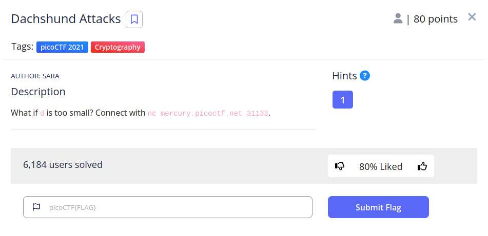
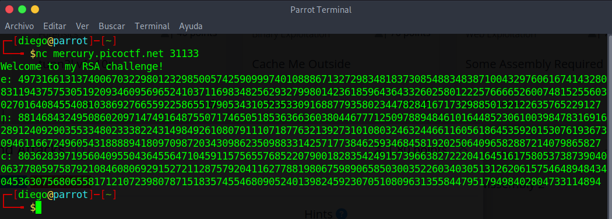

# Dachshund Attacks

## Descripción
Do you know how to move between directories and read files in the shell? Start the container, `ssh` to it, and then `ls` once connected to begin. Login via `ssh` as `ctf-player` with the password, `abcba9f7`
Additional details will be available after launching your challenge instance.

## Resolucion
Una vez lanzada la instancia, nos conectamos con el comando proporcionado a esta e introducimos la contraseña del usuario. La carpeta principal tendrá los siguientes archivos:

