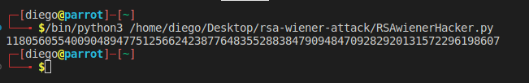
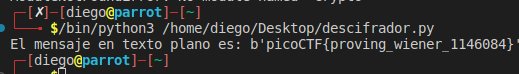

# Dachshund Attacks


## Descripción
What if d is too small? Connect with nc mercury.picoctf.net 31133.

## Resolucion
Nos conectamos al servidor y al puerto proporcionado con:

```
nc mercury.picoctf.net 31133
```
Y obtenemos el siguiente mensaje:


- e: 49731661313740067032298012329850057425909997401088867132729834818373085488348387100432976061674143280831194375753051920934609569652410371169834825629327998014236185964364332602580122257666652600748152556030270164084554081038692766559225865517905343105235330916887793580234478284167173298850132122635765229127
- n: 8146843249508602097147491648755071746505185363663603804467771250978894846101644852306100398478316916289124092903553348023338224314984926108079111071877632139273101080324632446611605618645359201530761936730946116672496054318888941809709872034309862350988331425717738462593468458192025064096582887214079865827
- c (mensaje cifrado): 80362839719560409550436455647104591157565576852207900182835424915739663827222041645161758053738739040063778059758792108460806929152721128757920411627788198067598906585030035226034030513126206157546489484340453630756806558171210723980787151835745546809052401398245923070510809631355844795179498402804733114894

La forma de obtener el mensaje cifrado en el algoritmo RSA consiste en la fórmula:
c = m ^e^ mod n.

Para descifrar la clave, se realiza la misma operación, en vez de con el exponente, con la clave privada:
m = c ^d^ mod n.

Por el enunciado, sabemos que d es muy pequeña, y existe un ataque a los algoritmos RSA, llamado 'Wiener's attack', que se emplea en estos casos. 

Ya existen códigos de python para realizar esta tarea, en este caso, usaremos [rsa-wiener-attack](https://github.com/pablocelayes/rsa-wiener-atta):

```
git clone https://github.com/pablocelayes/rsa-wiener-atta
```

Modificamos ligeramente el código de pablocelayes:

```
'''
Created on Dec 14, 2011

@author: pablocelayes
'''

import ContinuedFractions, Arithmetic, RSAvulnerableKeyGenerator

def hack_RSA(e,n):
    '''
    Finds d knowing (e,n)
    applying the Wiener continued fraction attack
    '''
    frac = ContinuedFractions.rational_to_contfrac(e, n)
    convergents = ContinuedFractions.convergents_from_contfrac(frac)
    
    for (k,d) in convergents:
        
        #check if d is actually the key
        if k!=0 and (e*d-1)%k == 0:
            phi = (e*d-1)//k
            s = n - phi + 1
            # check if the equation x^2 - s*x + n = 0
            # has integer roots
            discr = s*s - 4*n
            if(discr>=0):
                t = Arithmetic.is_perfect_square(discr)
                if t!=-1 and (s+t)%2==0:
                    print(d)

e = 49731661313740067032298012329850057425909997401088867132729834818373085488348387100432976061674143280831194375753051920934609569652410371169834825629327998014236185964364332602580122257666652600748152556030270164084554081038692766559225865517905343105235330916887793580234478284167173298850132122635765229127
n = 88146843249508602097147491648755071746505185363663603804467771250978894846101644852306100398478316916289124092903553348023338224314984926108079111071877632139273101080324632446611605618645359201530761936730946116672496054318888941809709872034309862350988331425717738462593468458192025064096582887214079865827

hack_RSA(e, n)
```

Y obtenemos el siguiente resultado:



Creamos ahora el código en python para poder leer el mensaje:

```
from Cryptodome.Util.number import long_to_bytes

n = 88146843249508602097147491648755071746505185363663603804467771250978894846101644852306100398478316916289124092903553348023338224314984926108079111071877632139273101080324632446611605618645359201530761936730946116672496054318888941809709872034309862350988331425717738462593468458192025064096582887214079865827
c = 80362839719560409550436455647104591157565576852207900182835424915739663827222041645161758053738739040063778059758792108460806929152721128757920411627788198067598906585030035226034030513126206157546489484340453630756806558171210723980787151835745546809052401398245923070510809631355844795179498402804733114894
d = 1180560554009048947751256624238776483552883847909484709282920131572296198607

m = pow(c, d, n)

print("El mensaje en texto plano es: {}".format(long_to_bytes(m)))
```

Obteniendo como resultado lo siguiente:



Obteniendo así la flag: 'picoCTF{proving_wiener_1146084}'
