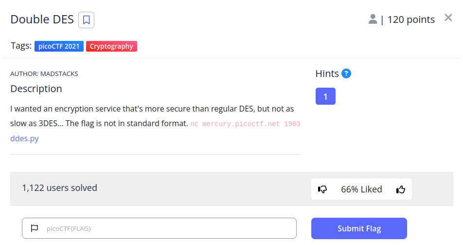
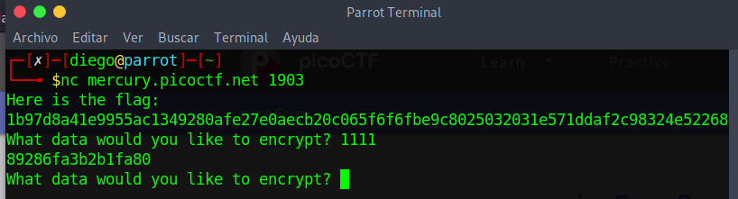
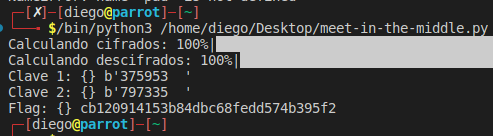

# Double DES


## Descripción
I wanted an encryption service that's more secure than regular DES, but not as slow as 3DES... The flag is not in standard format. nc mercury.picoctf.net 1903 [ddes.py](https://mercury.picoctf.net/static/69973442012f30ecf714dd1c0c7a7d4e/ddes.py)

## Resolucion
Al conectarnos por netcat nos proporcionan la flag y la opción de encriptar un mensaje:



- flag: 1b97d8a41e9955ac1349280afe27e0aecb20c065f6f6fbe9c8025032031e571ddaf2c98324e52268
- 1111: 89286fa3b2b1fa80

Nos dicen en la descipción que el método utilizado es Doble DES. ESte método es vulnerable al ataque 'meet-in-the-middle'.

Este ataque consiste en lo siguiente:
1. Realizar todos los cifrados posibles del texto en claro (2^56)
2. Realizar todos los descifrados posibles del texto no legible (2^56)
3. Comparar los dos conjuntos y, si hay una coincidencia, habremos obtenido las dos claves.

Esto reduce las posibles contraseñas de 2^112 a 2^57. Esto es porque se está haciendo 2^56 dos veces (2*2^56 = 2^57).

Más información se puede encontrar en [stack exchange](https://security.stackexchange.com/questions/122624/how-does-the-meet-in-the-middle-attack-work-on-double-des/122626#122626)

Vamos a examinar el código de ddes.py. En él nos encontramos cómo se genera la clave:

```
def generate_key():
    return pad("".join(random.choice(string.digits) for _ in range(6)))
```

Por esto sabemos que la clave sólo tiene 6 posibles combinaciones, el resto es relleno (o padding).

Sabiendo esto, podemos elaborar el siguiente srcript de python:

```
import binascii
from Crypto.Cipher import DES
from tqdm import tqdm

#pad copiado de ddes.py
def pad(msg):
    block_len = 8
    over = len(msg) % block_len
    pad = block_len - over
    return (msg + " " * pad).encode()

def combinatoriaDES(descripcion, input, encrypt):
    diccionario = {}
    for key in tqdm(range(MAXCOMBINACION), desc=descripcion):
        key = (f"{key:06}" + padding).encode()                                  #Modificcamos la calve para que tenga el padding necesario
        cipher = DES.new(key, DES.MODE_ECB)
        result = cipher.encrypt(input) if encrypt else cipher.decrypt(input)    #Calculamos el resultado con la clave según se cifre o descifre
        diccionario[result] = key                                               #Guardamos el par resultado-clave en el diccionario
    return diccionario

padding = "  "
flag = binascii.unhexlify("6f745ccee635f76746be185541b9f9c046b8d707f93d0522e2325fb041c59ec7bbbaa818d7c51381")
#Convertimos a bytes y saneamos el input con el pad
inputBytes = pad(binascii.unhexlify("13371337").decode())
cifradoBytes = binascii.unhexlify("8f45ca8a9264c2aa")
MAXCOMBINACION = 999999

#Calculamos posibles claves
diccionarioCifrado = combinatoriaDES("Calculando cifrados", inputBytes, True)
diccionarioDescifrado = combinatoriaDES("Calculando descifrados", cifradoBytes, False)

'''
Cambiamos a set para tener complejidad O(1) con la intersección.
Aunque se use keys(), se están comparando los cifrados con los descifrados,
solo que se llaman keys por ser la clave del diccionario
'''
conjunto = set(diccionarioCifrado.keys()) & set(diccionarioDescifrado.keys())

#Obtenemos la coincidencia y las claves del cifrado y descifrado de los diccionarios
cifradoIdentico = conjunto.pop()
primeraKey = diccionarioCifrado[cifradoIdentico]
segundaKey = diccionarioDescifrado[cifradoIdentico]

print("Clave 1: {}", primeraKey)
print("Clave 2: {}", segundaKey)

#Creamos los objetos DES para descifrar la flag
cifrado1 = DES.new(primeraKey, DES.MODE_ECB)
cifrado2 = DES.new(segundaKey, DES.MODE_ECB)

flagDescifrada = cifrado1.decrypt(cifrado2.decrypt(flag)).decode()
print("Flag: {}", flagDescifrada)
```

Al ejecutar el script obtendremos lo siguiente:



Consiguiendo así la flag: 'cb120914153b84dbc68fedd574b395f2'.