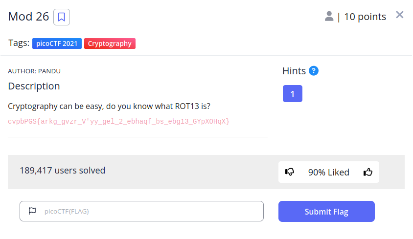
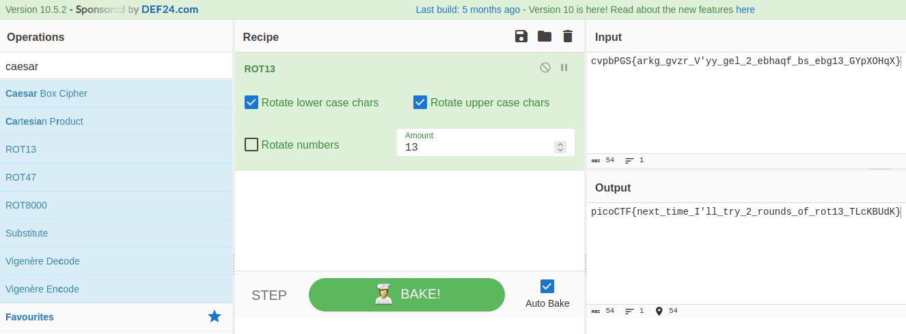

# Mod 26

## Descripción
Cryptography can be easy, do you know what ROT13 is? cvpbPGS{arkg_gvzr_V'yy_gel_2_ebhaqf_bs_ebg13_GYpXOHqX}

## Resolución
En este CTF se nos proporciona la bandera cofrada en la descripción junto con la pregunta ¿Sabes lo que es ROT13?

ROT13 es una forma de cifrado César (cifrado por desplazamiento) donde cada letra toma el valor de la que viene n veces detrás de ella en el alfabeto. Ese n es la clave que nos indica el desplazamiento.

ROT13 utiliza como clave 13, por lo que obtener la bandera es muy sencillo:

Primero, entramos en [https://gchq.github.io/CyberChef/](https://gchq.github.io/CyberChef/)

Segundo, introducimos en el input la bandera cifrada y en la receta el algoritmo ROT13:

Una vez realizado esto tendremos resuelto el CTF con la flag 'picoCTF{next_time_I'll_try_2_rounds_of_rot13_TLcKBUdK}'.