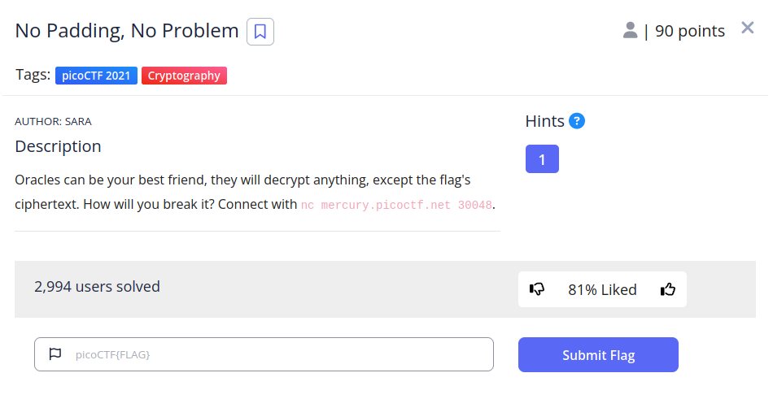
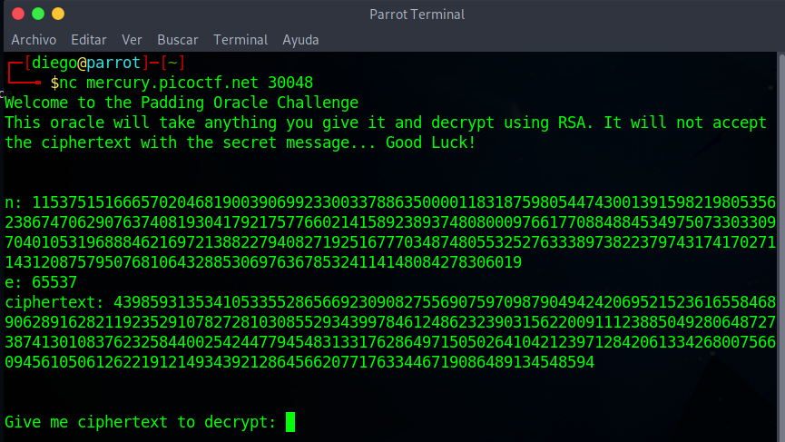
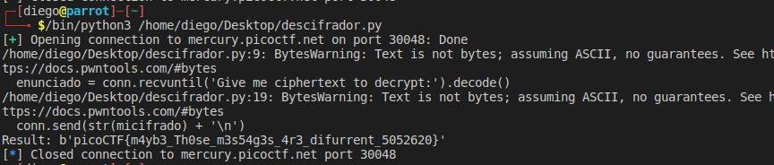

# No Padding, No Problem


## Descripción
Oracles can be your best friend, they will decrypt anything, except the flag's ciphertext. How will you break it? Connect with nc mercury.picoctf.net 30048.

## Resolucion
Nos conectamos al servidor y al puerto proporcionado con:
```
nc mercury.picoctf.net 30048 
```

Y obtenemos la siguiente respuesta:



- n: 115375151666570204681900390699233003378863500001183187598054474300139159821980535623867470629076374081930417921757766021415892389374808000976617708848845349750733033097040105319688846216972138822794082719251677703487480553252763338973822379743174170271143120875795076810643288530697636785324114148084278306019
- e: 65537
- c: 43985931353410533552865669230908275569075970987904942420695215236165584689062891628211923529107827281030855293439978461248623239031562200911123885049280648727387413010837623258440025424477945483133176286497150502641042123971284206133426800756609456105061262219121493439212864566207717633446719086489134548594

Nos dice que no podemos introducir el texto cifrado (c) para descifrarlo. Para poder afrontar este CTF tenemos que tener muy claro como funciona rsa:

c = m^e mod n

m = c^d mod n #Esta es la fórmula que nos interesa

Además, por el enunciado del CTF, sabemos que nos encontramos ante un cifrado RSA si padding, por lo que no tenemos que preopuparnos por la longitud de lo que queremos cifrar.

El cifrado RSA sin padding es homomórfico, lo que significa que:

cifrado(x) * cifrado(y) = cifrado(x*y)

Por lo que podemos, por ejemplo, cifrar '2', multiplicar el resultado por m, descifrarlo y luego dividirlo entre 2.

Otro problema que tenemos es que cada vez que nos conectamos al servidor cambia la clave privada, por lo que tendremos que construir un script en python que haga todo en la misma interacción:

```
from Crypto.Util.number import *    #lonng_to_bytes
from pwn import *                   #remote()
from decimal import *               #Decimal()
import re                           #search()

getcontext().prec = 1000 #Precisión de Decimal()

conn = remote('mercury.picoctf.net', 30048)
enunciado = conn.recvuntil('Give me ciphertext to decrypt:').decode()

#Obtenemos n, e y c con expresiones regulares
mensaje = re.search(r"n: ([0-9]+)\ne: ([0-9]+)\nciphertext: ([0-9]+)", enunciado)
n = int(mensaje[1])
e = int(mensaje[2])
c = int(mensaje[3])

micifrado = c * pow(2, e, n)

conn.send(str(micifrado) + '\n')

resultado = conn.recvline().decode()

#Buscamos el texto cifrado
mensaje = re.search(r"([0-9]+)", resultado)
resultado = int(Decimal(mensaje[1]) / 2)

print('Result:', long_to_bytes(resultado))
```



Obteniendo así la flag: 'picoCTF{m4yb3_Th0se_m3s54g3s_4r3_difurrent_5052620}'