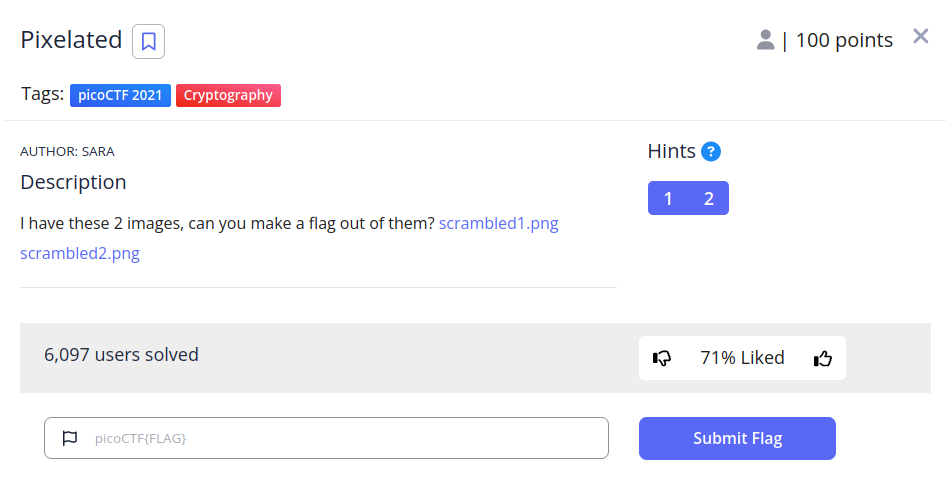

# Pixelated


## Descripción
I have these 2 images, can you make a flag out of them? [scrambled1.png](https://mercury.picoctf.net/static/6e4afb967ef8c865f79f3a8cd7767cca/scrambled1.png) [scrambled2.png](https://mercury.picoctf.net/static/6e4afb967ef8c865f79f3a8cd7767cca/scrambled2.png)

## Resolucion
Nos descargamos las imágenes y las guardamos en el escritorio:


El enunciado del CTF nos dice si podemos hacer una flag con las dos imágenes, por lo que podemos pensar que se trata de realizar alguna operación con ellas. Normalmente en criptografía se utiliza XOR, por lo que probaremos a hacer un XOR de ambas imágenes:

```
gmic scrambled1.png scrambled2.png -blend xor -o result.png
```

Obtenemos como resultado lo siguiente:


Probando con and y or no se obtiene resultado.

Podemos crear un código en python para tratar las imágenes como matrices, para en vez de realizar operaciones lógicas usar operaciones matemáticas:

```
import numpy as np
from PIL import Image

# Obtenemos imágenes (hay que ejecutar el script en la misma carpeta)
imagen1 = Image.open("scrambled1.png")
imagen2 = Image.open("scrambled2.png")

# Convertimos las imágenes en matrices
array1 = np.array(imagen1)
array2 = np.array(imagen2)

# Sumamos las matrices
array3 = array1 + array2

# Convertimos la matriz a imagen y guardamos
Image.fromarray(array3).save('output.png')
```

Con este código obtenemos el siguiente resultado:


Obteniendo la flag 'picoCTF{0542dc1d}' como resultado.