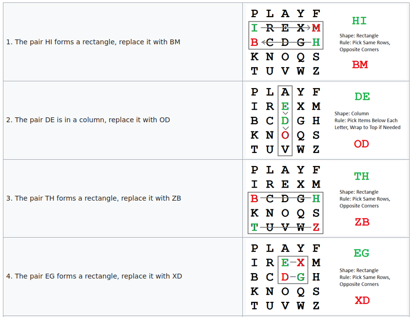
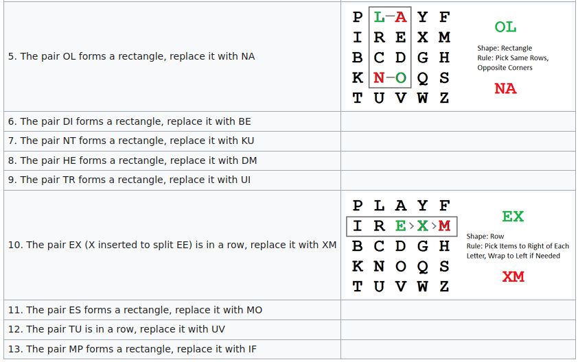
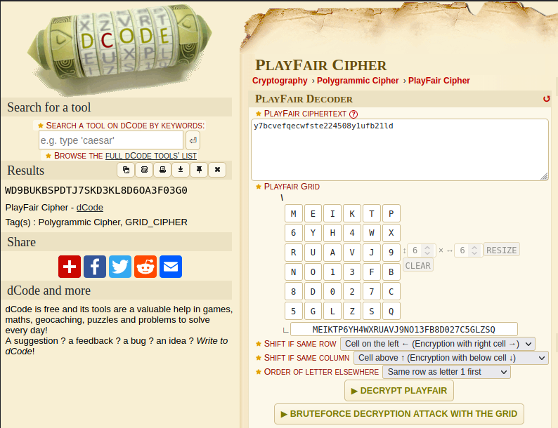

# Play Nice


## Descripción
Not all ancient ciphers were so bad... The flag is not in standard format. nc mercury.picoctf.net 6057 [playfair.py](https://mercury.picoctf.net/static/a48f79c95043804d1f43d5bfbffd324a/playfair.py)

## Resolucion
Al conectarnos por netcat obtenemos el siguiente mensaje:


También nos dan el siguiente código en python:

```
#!/usr/bin/python3 -u
import signal

SQUARE_SIZE = 6


def generate_square(alphabet):
	assert len(alphabet) == pow(SQUARE_SIZE, 2)
	matrix = []
	for i, letter in enumerate(alphabet):
		if i % SQUARE_SIZE == 0:
			row = []
		row.append(letter)
		if i % SQUARE_SIZE == (SQUARE_SIZE - 1):
			matrix.append(row)
	return matrix

def get_index(letter, matrix):
	for row in range(SQUARE_SIZE):
		for col in range(SQUARE_SIZE):
			if matrix[row][col] == letter:
				return (row, col)
	print("letter not found in matrix.")
	exit()

def encrypt_pair(pair, matrix):
	p1 = get_index(pair[0], matrix)
	p2 = get_index(pair[1], matrix)

	if p1[0] == p2[0]:
		return matrix[p1[0]][(p1[1] + 1)  % SQUARE_SIZE] + matrix[p2[0]][(p2[1] + 1)  % SQUARE_SIZE]
	elif p1[1] == p2[1]:
		return matrix[(p1[0] + 1)  % SQUARE_SIZE][p1[1]] + matrix[(p2[0] + 1)  % SQUARE_SIZE][p2[1]]
	else:
		return matrix[p1[0]][p2[1]] + matrix[p2[0]][p1[1]]

def encrypt_string(s, matrix):
	result = ""
	if len(s) % 2 == 0:
		plain = s
	else:
		plain = s + "meiktp6yh4wxruavj9no13fb8d027c5glzsq"[0]
	for i in range(0, len(plain), 2):
		result += encrypt_pair(plain[i:i + 2], matrix)
	return result

alphabet = open("key").read().rstrip()
m = generate_square(alphabet)
msg = open("msg").read().rstrip()
enc_msg = encrypt_string(msg, m)
print("Here is the alphabet: {}\nHere is the encrypted message: {}".format(alphabet, enc_msg))
signal.alarm(18)
resp = input("What is the plaintext message? ").rstrip()
if resp and resp == msg:
	print("Congratulations! Here's the flag: {}".format(open("flag").read()))

# https://en.wikipedia.org/wiki/Playfair_cipher
```

Entrando en la URL comentada, vemos cómo funciona el cifrado:





Podemos encontrar un [descifrador online](https://www.dcode.fr/playfair-cipher)



El problema es que nos da el resultado en mayúsculas, para transformar el string usaremos python:


Y al introducirlo en el programa obtendremos la flag:


Siendo esta '2e71b99fd3d07af3808f8dff2652ae0e'.
