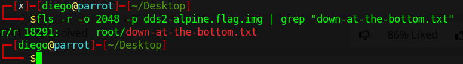

# Disk, disk, sleuth! II


## Descripción
All we know is the file with the flag is named `down-at-the-bottom.txt`... Disk image: [dds2-alpine.flag.img.gz](https://mercury.picoctf.net/static/b369e0ba3b6ffd2be8164cd3c99c294b/dds2-alpine.flag.img.gz)

## Resolucion
Nos proporcionan una imagen comprimida, por lo que la descomprimimos primero:

```
gunzip dds2-alpine.flag.img.gz
```

Para poder ver los directorios y archivos del disco proporcionado podemos usar 'fls', pero intentar acceder a la información del disco directamente nos dará un error:


Esto se debe a que el disco está particionado, para ver las particiones usaremos el comando:

```
mmls dds2-alpine.flag.img
```


Y así podremos ver que el sistema operativo comienza en 2048, por lo que podemos usar ya fls para encontrar el archivo:

```
fls -r -o 2048 -p dds2-alpine.flag.img | grep "down-at-the-bottom.txt"
```

El comando hace lo siguiente:
- fls: Busca archivos y directorios en una imagen de disco.
- - -r: Busca de forma recursiva (dentro de todas las carpetas disponibles).
- - -o: Comienza la búsqueda con un offset (desplazamiento), en este caso de 2048 bytes.
- - -p: Muestra toda la ruta (path) del archivo.
- |: Toma la salida del comando anterior y la redirife como entrada al siguiente comando.
- grep: Busca una cadena de caracteres en el texto proporcionado.
- - "down-at-the-bottom.txt": la cadena de caracteres que queremos que busque grep.

Obtendremos como resultado el inodo donde comienza el archivo:



Para poder ver su contenido usaremos 'icat', que dada una imagen, nos permite ver un archivo:

```
icat dds2-alpine.flag.img -o 2048 18291
```


Obteniendo así la flag: 'picoCTF{f0r3ns1c4t0r_n0v1c3_0ba8d02d}'