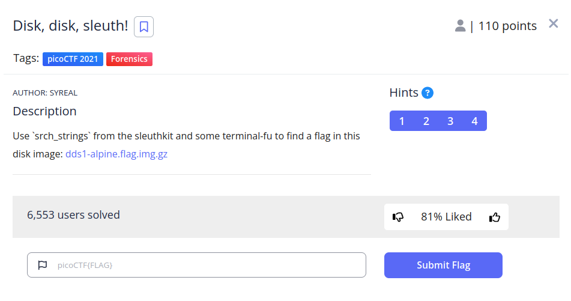
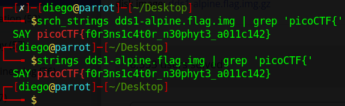

# Disk, disk, sleuth!


## Descripción
Use `srch_strings` from the sleuthkit and some terminal-fu to find a flag in this disk image: [dds1-alpine.flag.img.gz](https://mercury.picoctf.net/static/4f3df7052b4121aff89af1a3f517afb1/dds1-alpine.flag.img.gz)

## Resolucion
Nos proporcionan una imagen comprimida, por lo que la descomprimimos primero:

```
gunzip dds1-alpine.flag.img.gz
```

La descripción nos dice que usemos 'srch_strings' para encontrar la flag, este comando es igual que 'strings', nos permite encontrar cadenas de caracteres en programas.

Podremos usar cualquiera de los siguientes comandos:

```
srch_strings dds1-alpine.flag.img | grep 'picoCTF{'
```


```
strings dds1-alpine.flag.img | grep 'picoCTF{'
```



Obteniendo así la flag 'picoCTF{f0r3ns1c4t0r_n30phyt3_a011c142}'.