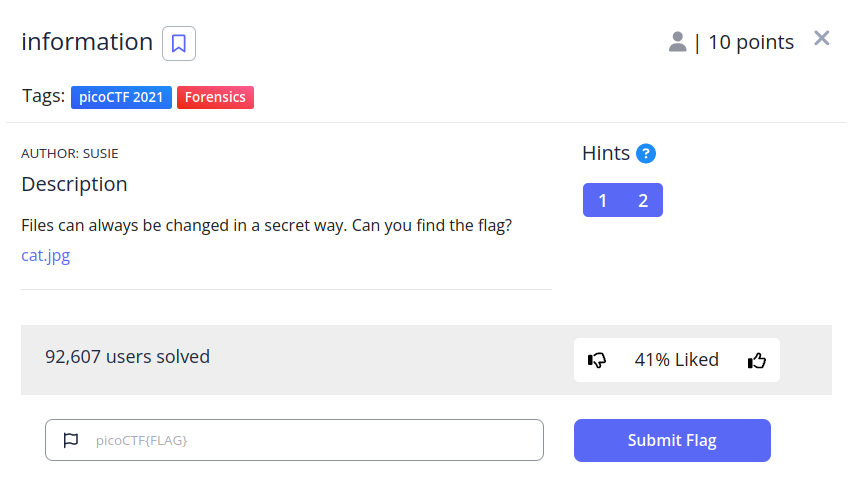
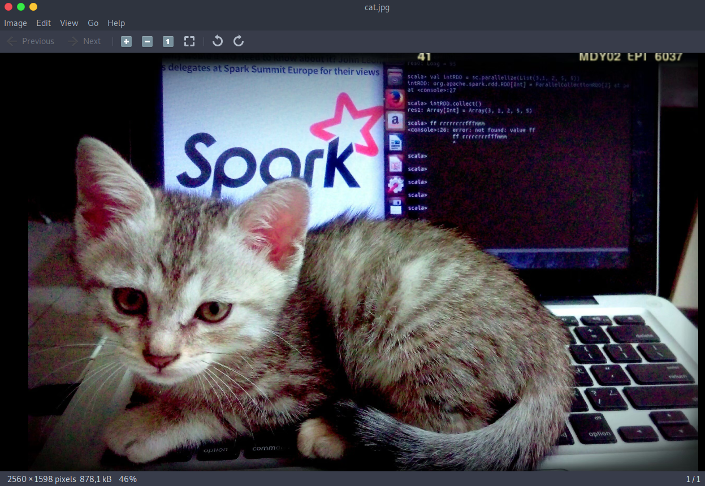
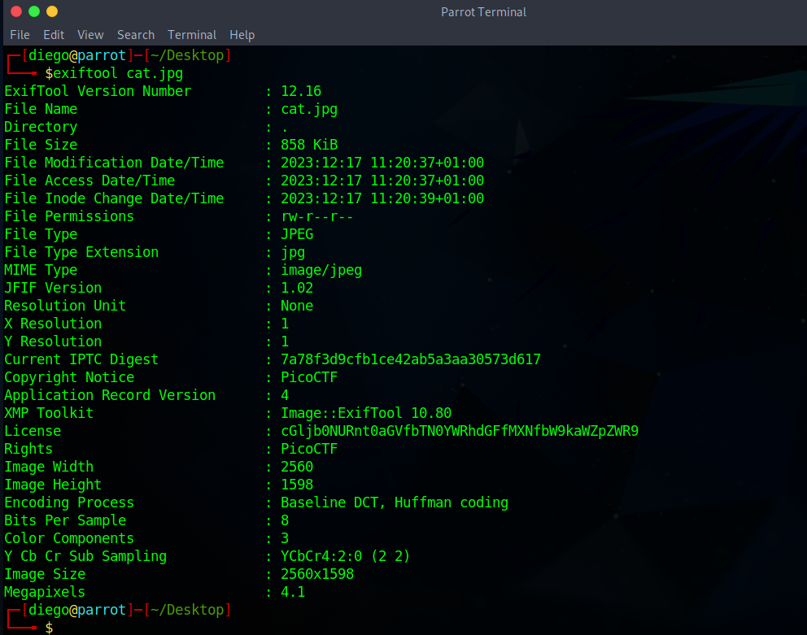
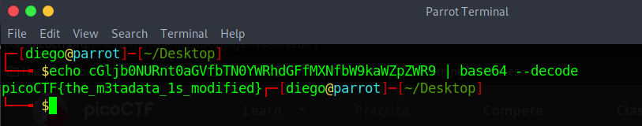

# Information

## Descripción
Files can always be changed in a secret way. Can you find the flag? [cat.jpg](https://mercury.picoctf.net/static/7cf6a33f90deeeac5c73407a1bdc99b6/cat.jpg)

## Resolución
En este CTF, se nos proporciona un archivo .jpg de un gato:

En una primera instancia, parece un CTF de esteganografía, donde se oculta información en un archivo (normalmente una imagen). Primero, vamos a mirar más información con el comando $exiftool:

Nos damos cuenta de que el campo de la licencia está modificado, probablemente en base 64, por lo que procedemos a decodificarlo:

Obteniendo así la flag 'picoCTF{the_m3tadata_1s_modified}'.