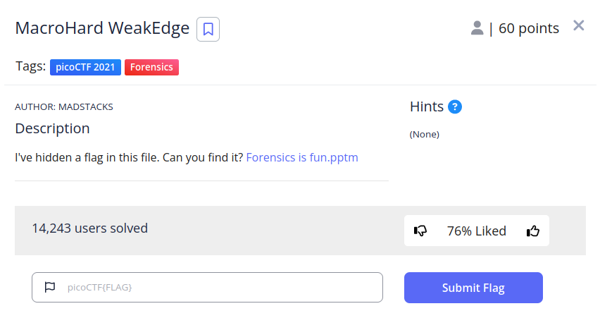
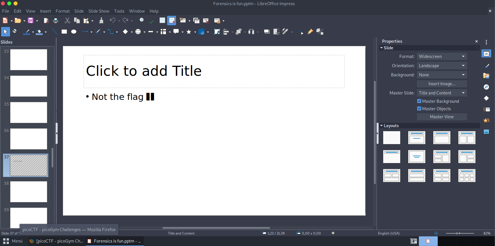
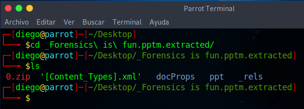
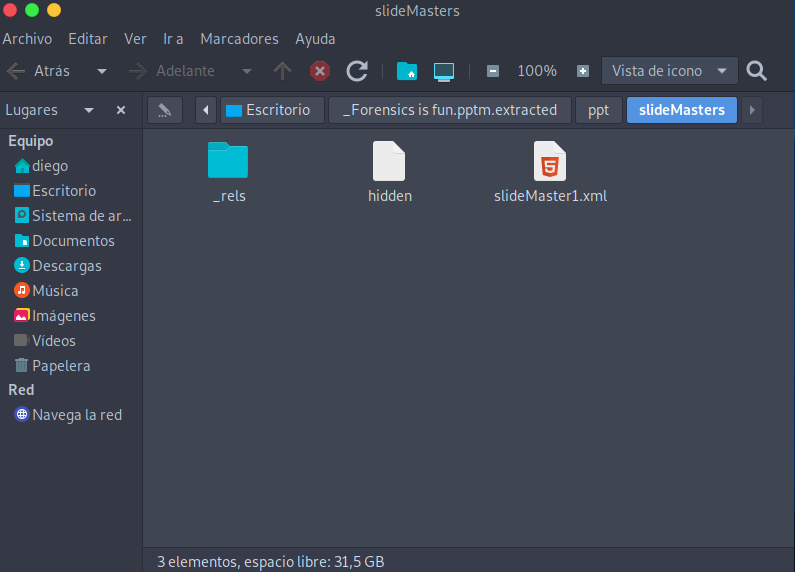
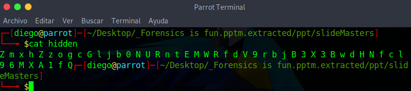
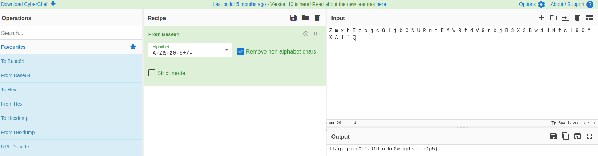

# Macrohard WeakEdge


## Descripción
I've hidden a flag in this file. Can you find it? [Forensics is fun.pptm](https://mercury.picoctf.net/static/9a7436948cc502e9cacf5bc84d2cccb5/Forensics%20is%20fun.pptm)

## Resolución
Nos dan un archivo .pptm, de hoja de presentaciones, al abrirlo tiene 58 diapositivas, todas en blanco menos la primera y la 37:



Exploramos con exiftool y con strings y no encontramos nada. Al extraer con binwalk:

```
binwalk -e Forensics\ is\ fun
```
 
Se nos creará la siguiente carpeta con este contenido:



Explorando el resultado del binwalk, encontraremos un archivo llamado hidden:



El archivo tendrá el siguiente contenido:



Introducimos el resultado en [Cyberchef](https://gchq.github.io/CyberChef/):



Y obtendremos la flag: 'picoCTF{Did_u_kn0w_ppts_r_zip5}'
