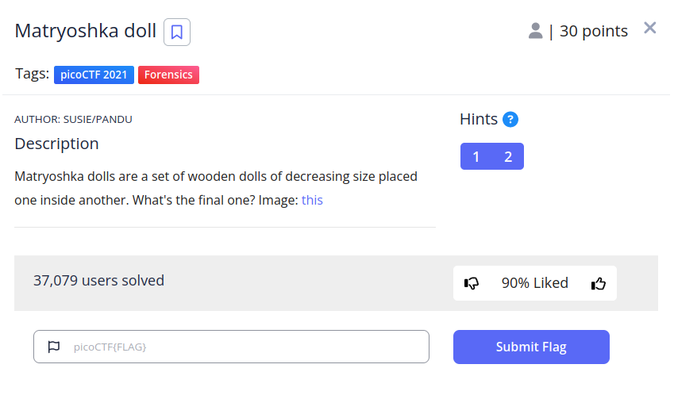
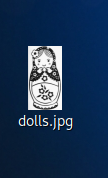
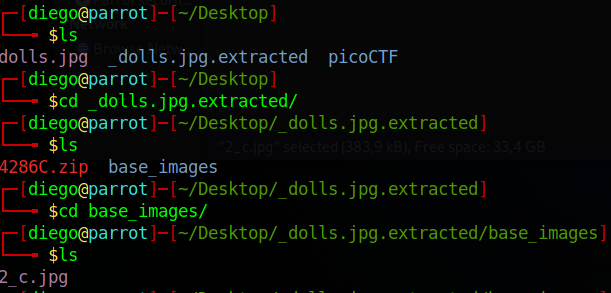
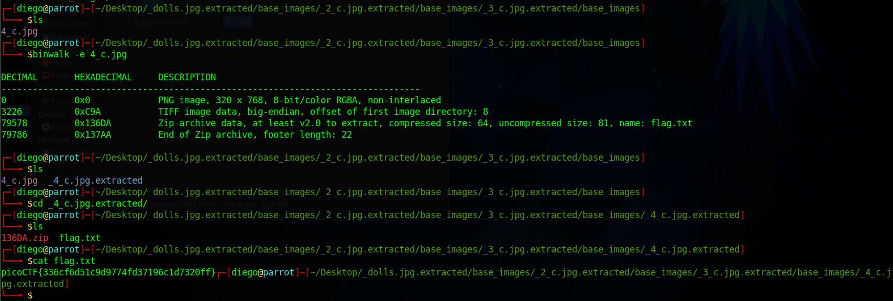

# ARMssembly 1

## Descripción
Matryoshka dolls are a set of wooden dolls of decreasing size placed one inside another. What's the final one? Image: [this](https://mercury.picoctf.net/static/5eb456e480e485183c9c1b16952c6eda/dolls.jpg)

## Resolución
En este CTF nos dan una imagen que no podemos abrir:

Si la analizamos con exiftool, vemos que en realidad es un.png

Vemos si tiene algún archivo dentro con la herramienta binwalk:

Y nos ha creado otra imagen llamada 2_c.jpg:

Repetimos el proceso dos veces más, creando 3_c.jpg y 4_c.jpg, pero obteniendo un archivo .txt con la flag al final.

Obteniendo así el archivo flag.txt con la flag 'picoCTF{336cf6d51c9d9774fd37196c1d7320ff}'.