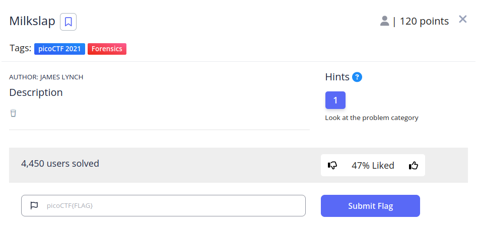
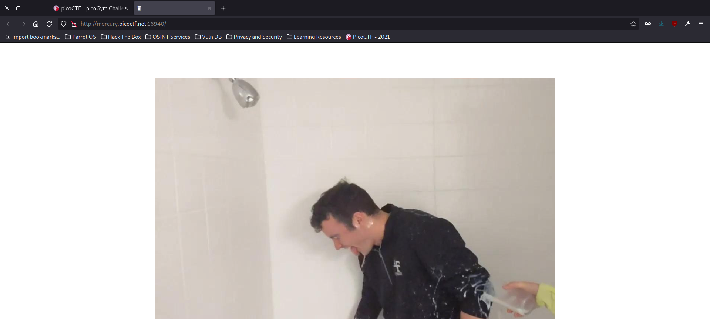
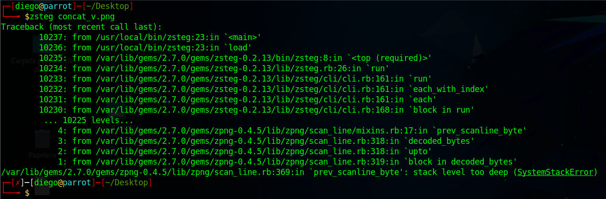
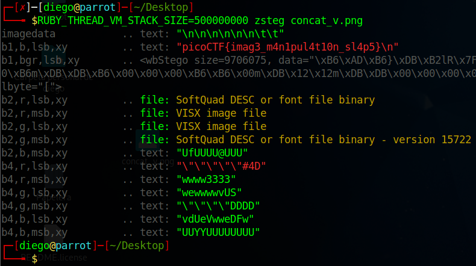

# DMilkslap


## Descripción
[🥛](http://mercury.picoctf.net:16940/)

## Resolucion
Nos dan acceso a la siguiente página web:



Con 'Ctrl+ u' vemos su código fuente, no encontramos información útil en el HTML o el JS, pero en el CSS está la ruta a la animación que vemos:

```
/* source: milkslap-milkslap.scss */
body {
  margin: 0;
  padding: 0;
  overflow: hidden; }

a {
  color: inherit; }

.center {
  width: 1080px;
  height: 720px;
  margin: 0 auto; }

#image {
  height: 720px;
  margin-top: 5%;
  margin-bottom: 20px;
  background-image: url(concat_v.png);
  background-position: 0 0; }

#foot {
  margin-bottom: 5px;
  color: #999999; }
  #foot h1 {
    font-family: serif;
    font-weight: normal;
    font-size: 1rem;
    text-align: center; }
```

Como este es un CTF de forense, probaremos a descargar y analizar 'concat_v.png'. Entramos en [http://mercury.picoctf.net:16940/concat_v.png](http://mercury.picoctf.net:16940/concat_v.png) y descargamos la imagen.

- La analizamos con exiftool pero no obtenemos ningún resultado.
- Binwalk -e tampoco nos dará nada.
- steghide no nos funcionará porque no tenemos salvoconducto.
- strings concat_v.png | grep 'pico' no dará ningun resultado.

Podemos buscar más herramientas de esteganografía en [https://github.com/JohnHammond/ctf-katana?tab=readme-ov-file#steganography](https://github.com/JohnHammond/ctf-katana?tab=readme-ov-file#steganography), si avanzamos por ella, vemos que para archivos .png se puede usar zsteg.

Para instalar zsteg usaremos:

```
gem install zsteg
```

Y para ejecutar usaremos:

```
zsteg concat_v.png
```

Sin embargo, esto nos dará un error:



Esto se debe a que la imagen es tan grande que zsteg se queda sin memoria, para solucionar esto podemos modificar el comando de la siguiente manera:

```
RUBY_THREAD_VM_STACK_SIZE=500000000 zsteg concat_v.png
```



Obteniendo así la flag 'picoCTF{imag3_m4n1pul4t10n_sl4p5}'.