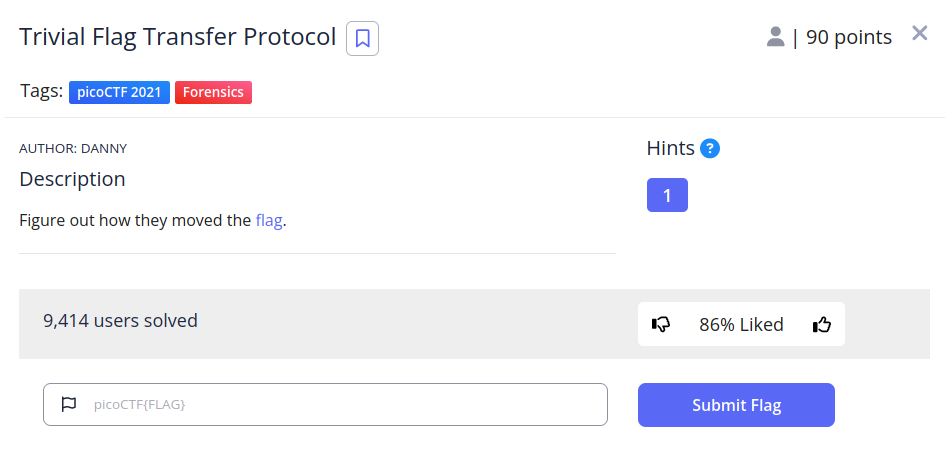
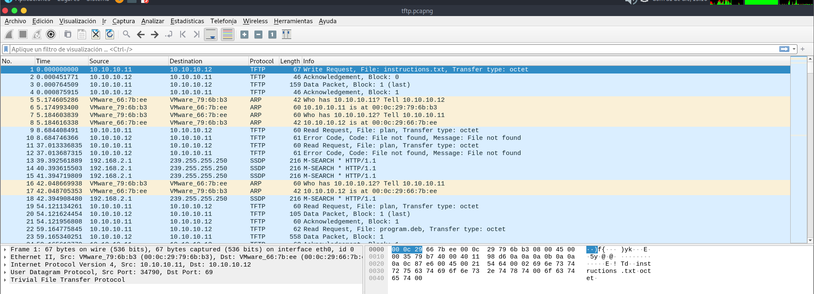
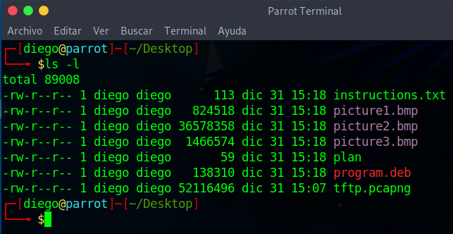
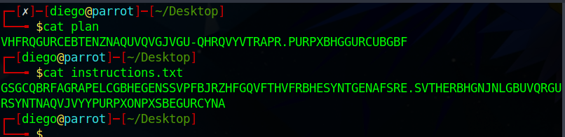
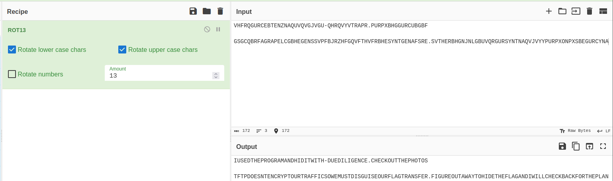
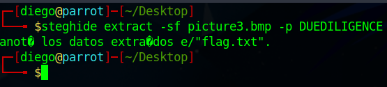
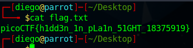

# Trivial Flag Transfer Protocol writeup
  

## Descripción
Figure out how they moved the [flag](https://mercury.picoctf.net/static/88553d672efbccbc5868002f4c6eb737/tftp.pcapng).

## Resolución
Nos proporcionan un archivo llamado ‘tftp.pcapng’, por lo que lo abrimos con wireshark, `wireshark tftp.pcapng &`:

Nos encontramos varios mensajes del protocolo ‘TFTP’ (Trivial File Transfer Protocol).

Entramos en Archivo -> Exportar objetos -> TFTP y guardamos todos los objetos en el escritorio.

Obtenemos los siguientes archivos:

Los archivos ‘plan’ e ‘instructions.txt’ parecen tener el contenido codificado:

Tras probar con [cybercheff](https://gchq.github.io/CyberChef/), resulta que se había usado ROT13:

Examinando las fotos, con binwalk no obtenemos nada, por lo que usamos steghide: `steghide extract -sf pictureX.bmp`.

El argumento extract sirve para indicar a steghide que debe extraer información.

El argumento -sf sirve para indicar el archivo a tratar.

Cuando nos pida salvoconducto, deberemos introducir ‘DUEDILIGENCE’, como nos da a entender el plan descifrado (también se puede pasar como argumento con -p).

Los dos primeros archivos no darán resultado, pero al finalizar el programa con el tercero se nos creará un archivo llamado ‘flag.txt’:

Obteniendo así la flag: ‘picoCTF{h1dd3n_1n_pLa1n_51GHT_18375919}’.