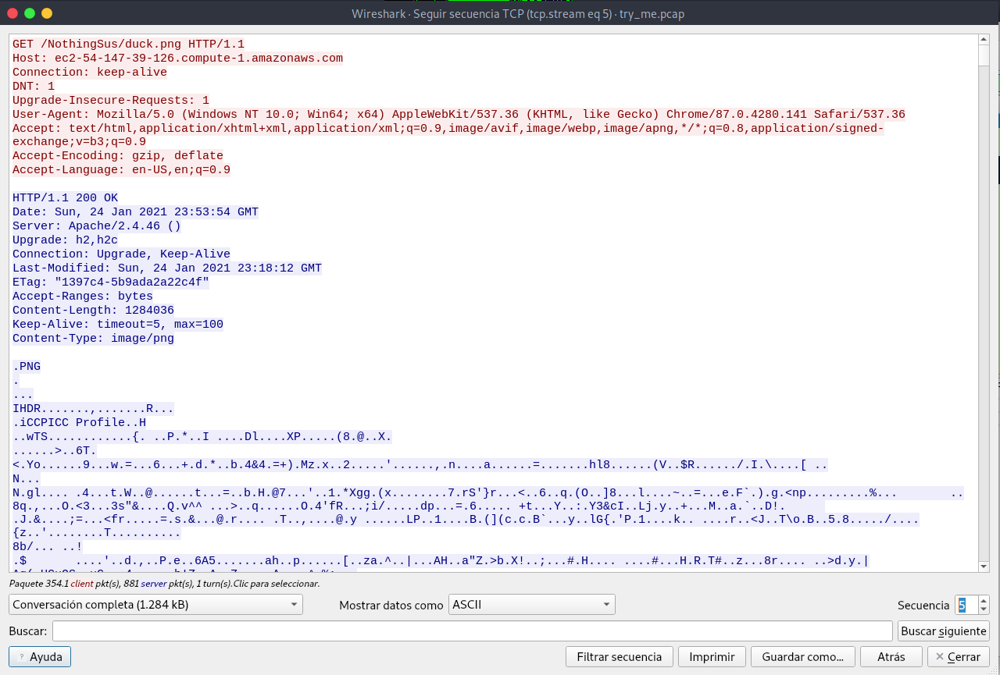

# Very very very Hidden


## Descripción
Finding a flag may take many steps, but if you look diligently it won't be long until you find the light at the end of the tunnel. Just remember, sometimes you find the hidden treasure, but sometimes you find only a hidden map to the treasure. [try_me.pcap](https://mercury.picoctf.net/static/a31839d2f338802e72855b13e3dcb798/try_me.pcap)

## Resolucion
Nos proporcionanun archivo .pcap, por lo que abrimos wireshark para analizarlo:

```
wireshark try_me.pcap &
```

Vamos a Analizar --> Seguir --> Secuencia TCP y analizamos los paquetes legibles:

Nos encontramos con que se descarga un archivo llamado 'duck.png' de aws:



También vemos la descarga de un favicon:


Y la descarga de otra imagen llamada 'evil_duck.png':


Y, por último, se accede a 'powershell.org':


Vamos a analizar los archivos descargados, Archivo --> Exportar objetos -->  HTTP:

Vemos que 'evil_duck.png', pese a tener peor calidad que 'duck.png' pesa más:


Probaremos las siguientes herramientas:
- strings evil_duck.png | grep 'pico': No dará resultado.
- binwalk -e evil_duck.png: No dará ningún archivo.
- steghide --extract -sf evil_duck.png: No funcionará porque no tenemos contraseña.
- zsteg evil_duck.png: No dará información relevante.

La última página visitada en las trazas de wireshark es powershell.org. Existe una herramienta llamada [Invoke PSImage](https://github.com/peewpw/Invoke-PSImage) capaz de ocultar en archivos .png código de PowerShell.

Para extraer este código podemos usar [Extract PSImage](https://github.com/imurasheen/Extract-PSImage), por lo que tendremos que ir a una máquina Windows para continuar con el CTF.

Al descargarlo nos dirá que se detecta un virus:


Desactivamos Windows Defender y habilitamos la ejecución de scripts en PowerShell con:

```
Set-ExecutionPolicy RemoteSigned -Scope CurrentUser ​
```

Ejecutamos ahora:

```
Import-Module .\Extract-Invoke-PSImage.ps1
```

Y ejecutamos el comando para extraer el código:

```
Extract-Invoke-PSImage -Image .\evil_duck.png -Out script.ps1
```


El contenido de 'script.ps1' será el siguiente:

```
$out = "flag.txt"
$enc = [system.Text.Encoding]::UTF8
$string1 = "HEYWherE(IS_tNE)50uP?^DId_YOu(]E@t*mY_3RD()B2g3l?"
$string2 = "8,:8+14>Fx0l+$*KjVD>[o*.;+1|*[n&2G^201l&,Mv+_'T_B"

$data1 = $enc.GetBytes($string1)
$bytes = $enc.GetBytes($string2)

for($i=0; $i -lt $bytes.count ; $i++)
{
    $bytes[$i] = $bytes[$i] -bxor $data1[$i]
}
[System.IO.File]::WriteAllBytes("$out", $bytes)
```

Copiamos el código y lo pegamos en el PowerShell ISE. Al ejecutarlo nos creará un archivo llamado 'flag.txt' 


Obteniendo así la flag: 'picoCTF{n1c3_job_f1nd1ng_th3_s3cr3t_in_the_im@g3}'.