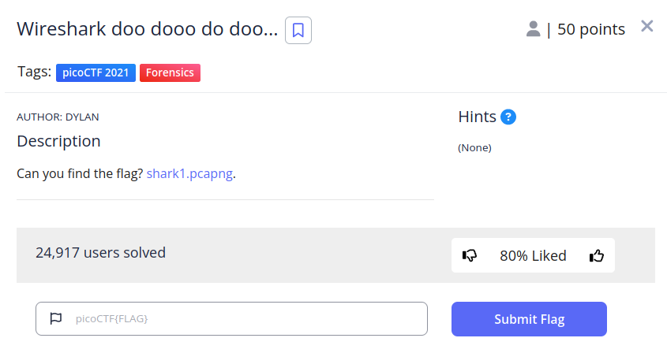
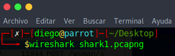
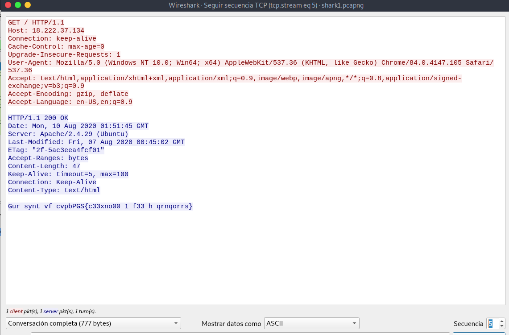
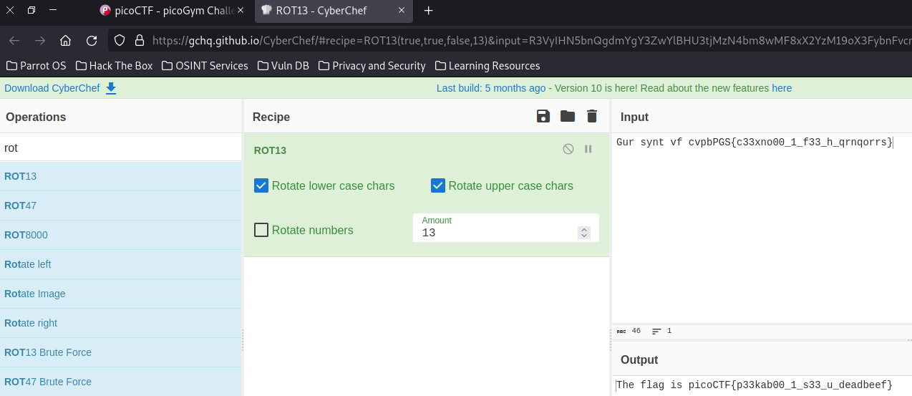

# Wireshark doo dooo ddo doo…

## Descripción
Can you find the flag? [shark1.pcapng](https://mercury.picoctf.net/static/d6f9aa16d2a2c51d2e431e658d87af9e/shark1.pcapng).

## Resolución
Nos descargamos el archivo y lo abrimos con wireshark:

Parece un intercambio de paquetes entre kerberos y un cliente usando los protocolos TCP y HTTP:

Analizando primero la secuencia TCP nos encontramos con 16 secuencias, donde la 5 parece tener un mensaje con formato de flag:

Como tiene caracteres alfabéticos, podemos pensar que es cifrado por un algoritmo de cifrado por rotación, lo llevamos a [cybercheff](https://gchq.github.io/CyberChef/) y probamos los diferentes algoritmos:

Con ROT13 obtendremos la flag 'picoCTF{p33kab00_1_s33_u_deadbeef}'