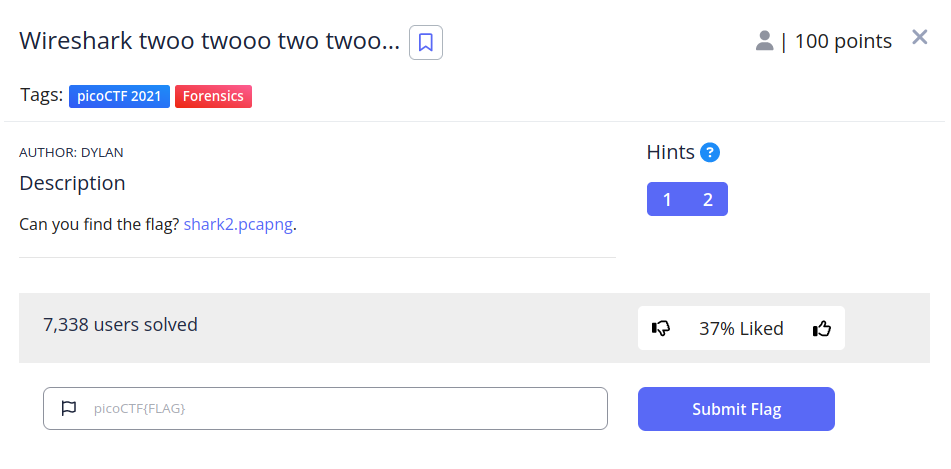
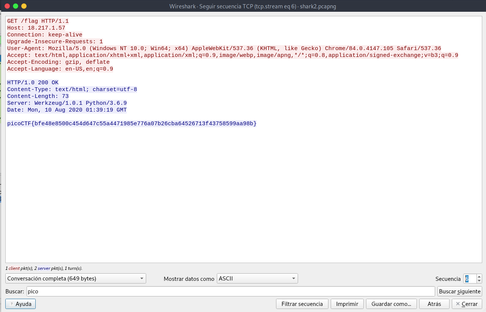
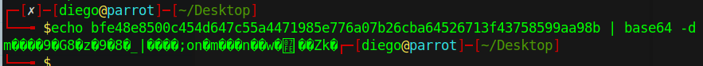
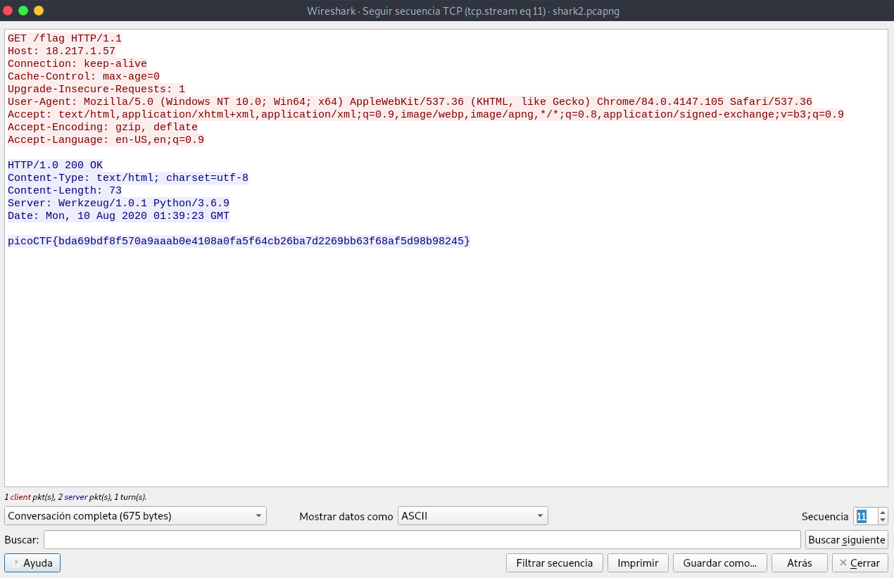
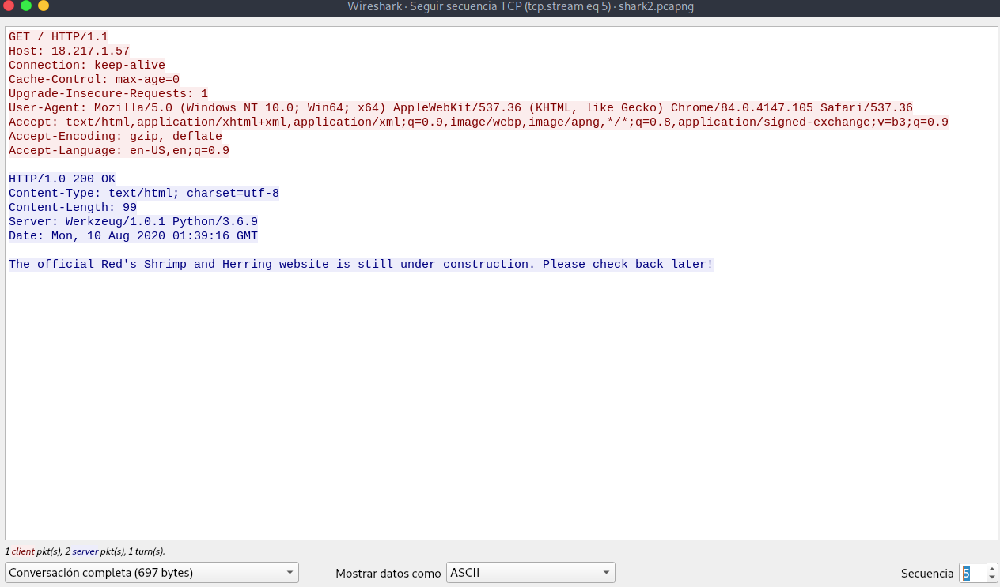
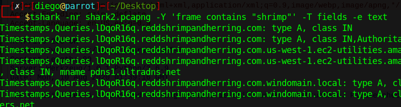
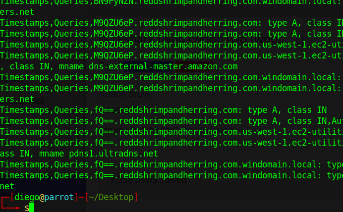
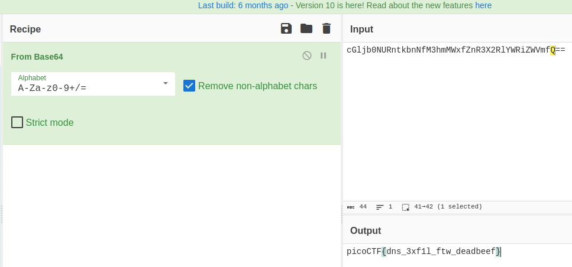

# Wireshark twoo twooo two twoo... writeup

## Descripción
Can you find the flag? [shark2.pcapng](https://mercury.picoctf.net/static/df92c613964fca8edec3b2981f69c3e4/shark2.pcapng).

## Resolución
Nos descargamos el archivo y lo abrimos con  `wireshark shark2.pcapng`

Una vez abierto, entramos en Analizar -> Seguir -> Secuencia TCP. En la secuencia 6 encontraremos algo parecido a una flag:

Está en base64, pero si lo decodificamos, no obtendremos solución:

Seguimos buscando en wireshark y obtenemos otra flag en la secuancia 11:

También hay flags en la secuencia 19, 20, 21, 23, 24, 25, 26, 27…

El seguimiento de TCP da muchas más flags, pero ninguna da resultado.

En la secuencia 5 encontramos algo que parece ser una pista:

«The official Red’s Shrimp and Herring website is still under cosntruction. Please check back later!»

Buscamos más información de la posible página con tshark y obtenemos un dominio:

Sin embargo, este dominio ya no está activo.

Examinando mejor la consulta de tshark, vemos que el último subdominio temina en ‘==’. Esto es muy típico en cadenas de caracteres que han sido codificadas a base64.

Volvemos a wireshark y aplicamos el filtro ‘dns and ip.dst==18.217.1.57’, para ver las solicitudes DNS al servidor y apuntamos todos los subdominios.

Los llevamos a [cybercheff](https://gchq.github.io/CyberChef/), con la configuración ‘From Base64’ y obtenemos la flag:

Obteniendo así la flag: 'picoCTF{dns_3xf1l_ftw_deadbeef}'.