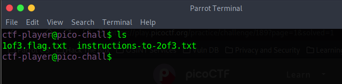

# Magikarp Ground Mission

## Descripción
Do you know how to move between directories and read files in the shell? Start the container, `ssh` to it, and then `ls` once connected to begin. Login via `ssh` as `ctf-player` with the password, `abcba9f7`
Additional details will be available after launching your challenge instance.

## Resolucion
Una vez lanzada la instancia, nos conectamos con el comando proporcionado a esta e introducimos la contraseña del usuario. La carpeta principal tendrá los siguientes archivos:

El archivo ‘1of3.flag.txt’ tiene el primer fragmento de la flag:

El archivo ‘instructions-to-2of3.txt’ nos dice que vayamos a la raíz.

Introducimos el comando ‘$cd /’ y comprobamos su contenido:

Ya tenemos la segunda parte de la flag, las últimas instrucciones nos dicen lo siguiente:

Nos movemos al directorio con ‘$cd ~’, listamos los archivos y encontramos el último fragmento de flag:

Cerramos la conexión con el comando '$exit'. 

Introducimos la flag picoCTF{xxsh_0ut_0f_\/\/4t3r_21cac893}