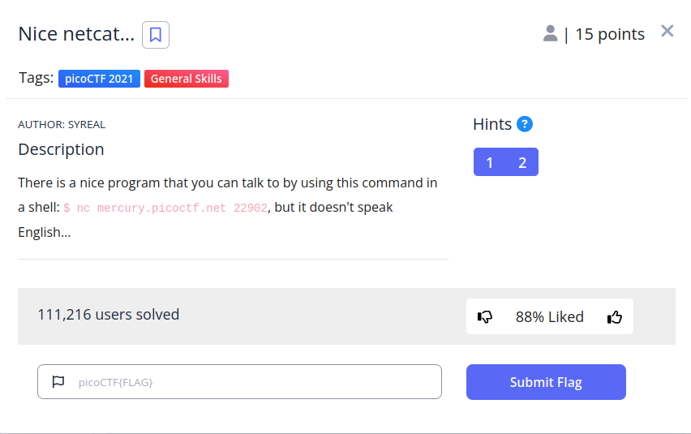

# Nice netcat


## Descripción
There is a nice program that you can talk to by using this command in a shell: $ nc mercury.picoctf.net 22902, but it doesn't speak English...

## Resolución
Para comenzar, nos conectaremos con el comando proporcionado al servidor:


Esto nos proporciona una ristra de números sin aparente sentido. El enunciado nos da la pista de que el programa no habla inglés, por lo que el texto debe estar codificado. Guardamos la salida del comando con la redirección de salida ‘>’:


Lo más probable, es que los números representen un carácter en ASCII, una forma de codificar caracteres, como UNICODE. En este código, a cada letra le corresponde un valor numérico, por ejemplo la p tiene asignado el 112, la i el 105…


Como los primeros resultados encajan con la estructura de la flag, escribiremos un script sencillo en bash que nos traduzca el archivo:


```
while read line; do echo -n "$(printf "\\$(printf '%o' "$line")")"; done < salida.txt
```

El script lee el archivo mientras tenga líneas y almacena cada línea en la variable line. «echo -n» elimina el salto de línea final. printf ‘%o’ convierte el valor a octal y las \\ agregan una barra para escapar el $, es decir, que se interprete como un comando. por último, redirigimos la entrada al archivo ‘salida.txt’ para que obtenga de este la información.

Con esto finalizaríamos el CTF. Obteniendo la flag 'picoCTF{g00d_k1tty!_n1c3_k1tty!_d3dfd6df}'