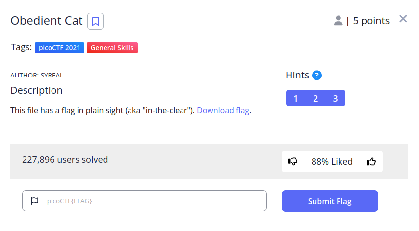
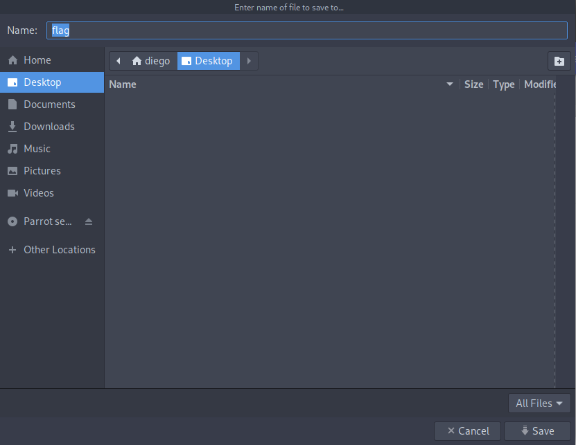

# Obedient cat


## Descripción
This file has a flag in plain sight (aka "in-the-clear"). [Download flag](https://mercury.picoctf.net/static/fb851c1858cc762bd4eed569013d7f00/flag).

## Resolución
Este es el primer CTF que nos ofrece PicoCTF. Para poder solucionarlo, nos descargaremos el archivo de la bandera:



Una vez descargado, podremos ver su contenido con el comando:

```
cat flag
```

Y así obtendremos la bandera 'picoCTF{s4n1ty_v3r1f13d_28e8376d}'.