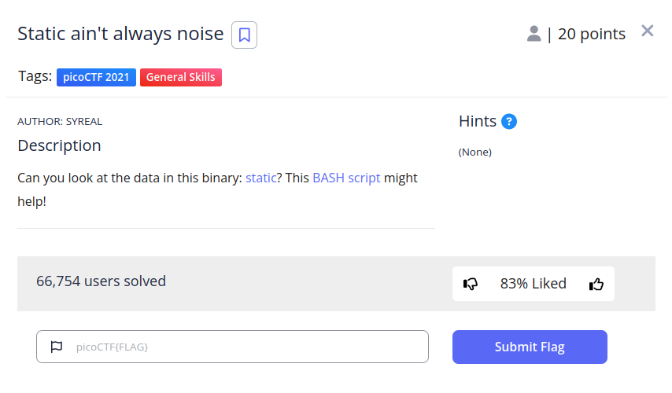
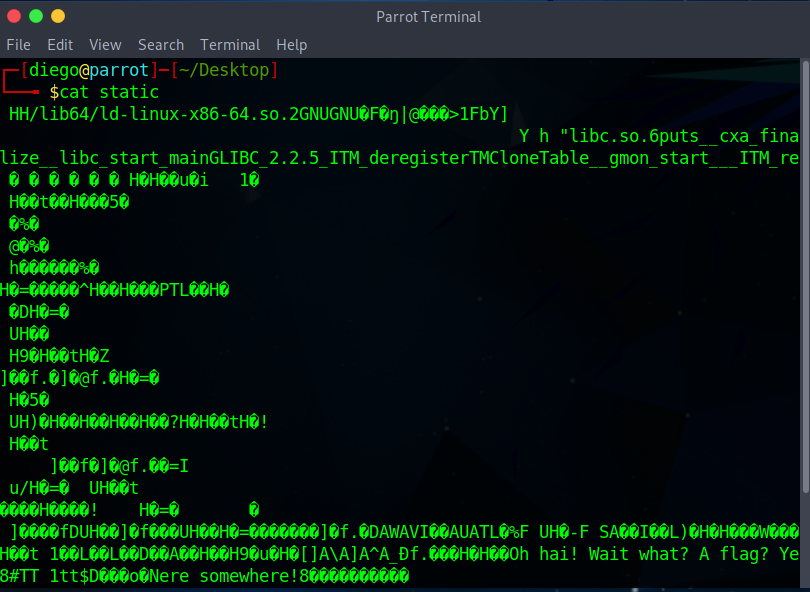
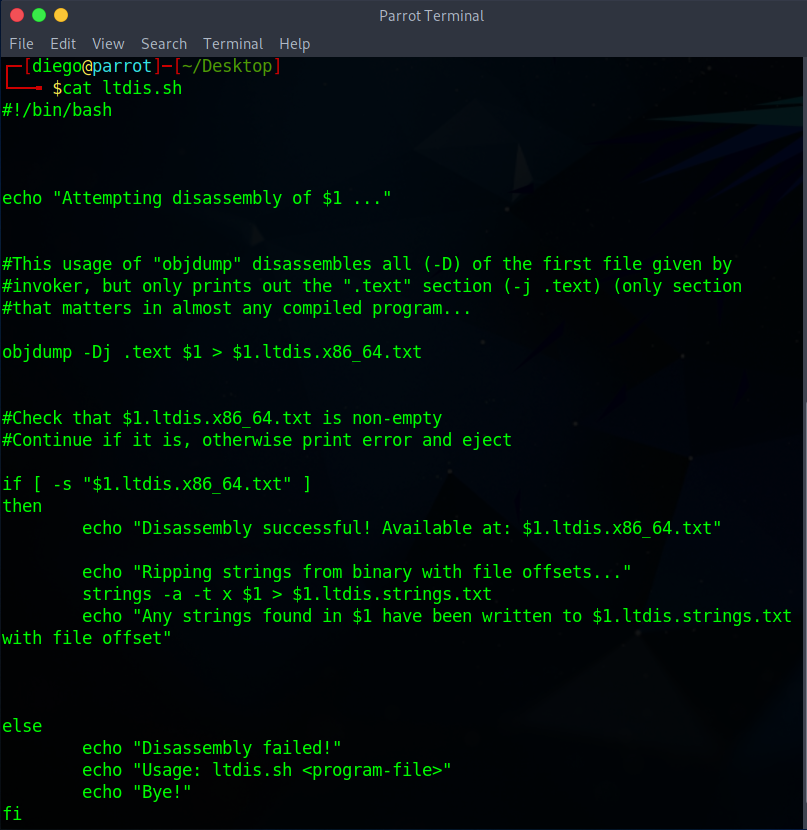
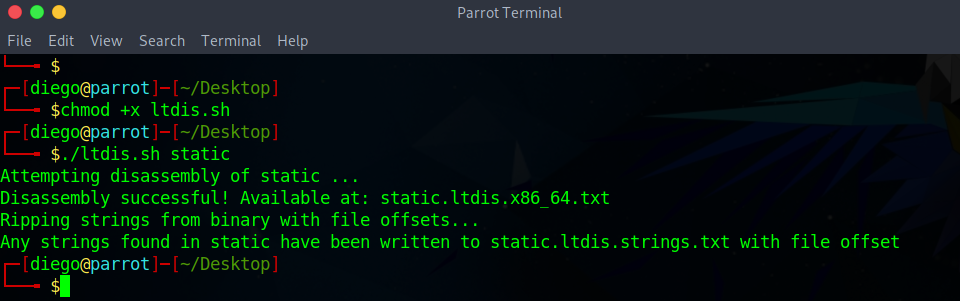
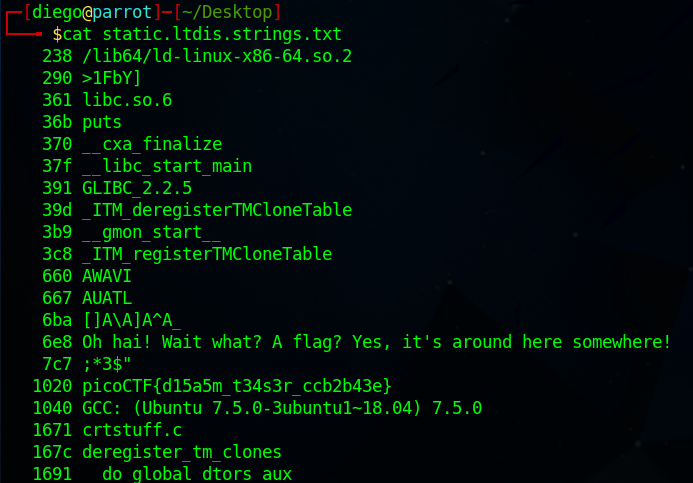

# Static ain't always noise

## Descripción
Can you look at the data in this binary: [static](https://mercury.picoctf.net/static/ff4e569d6b49b92d090796d4631a2577/static)? This [BASH script](https://mercury.picoctf.net/static/ff4e569d6b49b92d090796d4631a2577/ltdis.sh) might help!

## Resolución
En este CTF se nos proporciona un log junto con un archivo bash de Linux. El contenido del log en un principio es ilegible con cat:

Por el contrario, el script de bash tiene el siguiente contenido:

En una primera instancia, parece que obtiene información del binario que le proporcionemos como argumento ($1) y lo guarda en un archivo con el mismo nombre y «.ltdis.x86_64.txt», así que le damos permisos de ejecución y lo ejecutamos con el archivo binario como argumento:

Al mirar el contenido del archivo creado encontraremos la flag:

Obteniendo así la flag 'picoCTF{d15a5m_t34s3r_ccb2b43e}'