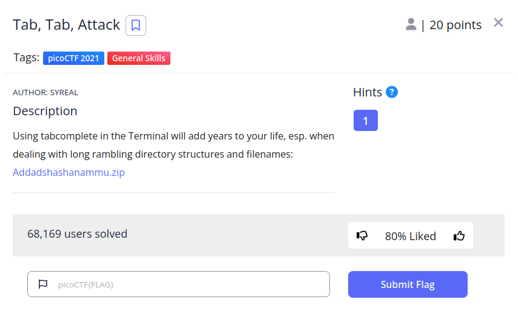
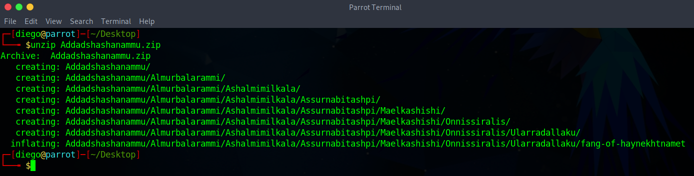
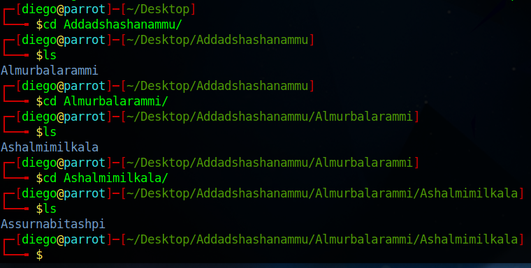
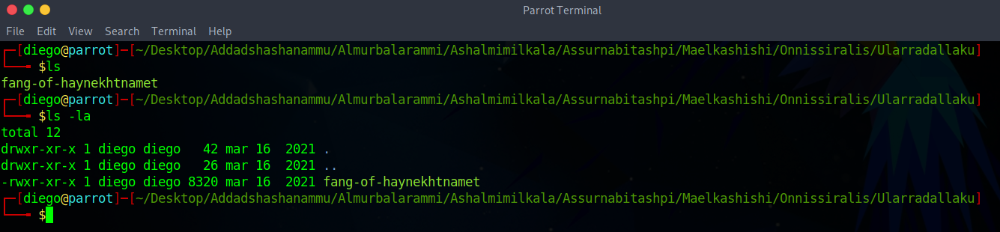
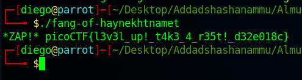

# ARMssembly 1

## Descripción
Using tabcomplete in the Terminal will add years to your life, esp. when dealing with long rambling directory structures and filenames: [Addadshashanammu.zip](https://mercury.picoctf.net/static/3afd18a65e42b80526aa87f9766c588b/Addadshashanammu.zip)

## Resolución
En este CTF nos dan un archivo .zip. lo descargamos y descomprimimos:

La estructura de la carpeta es una única subcarpeta, que contiene otra del mismo nombre sucesivamente:

Al llegar a cierta profundidad, encontraremos un archivo binario con permisos de ejecución:

Al ejecutarlo nos proporcionará la flag:

picoCTF{l3v3l_up!_t4k3_4_r35t!_d32e018c}