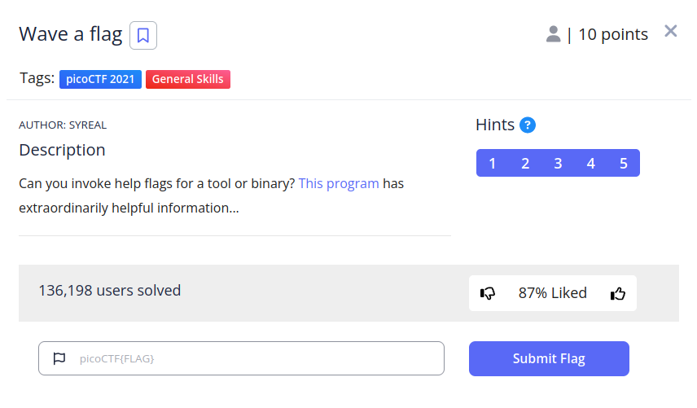
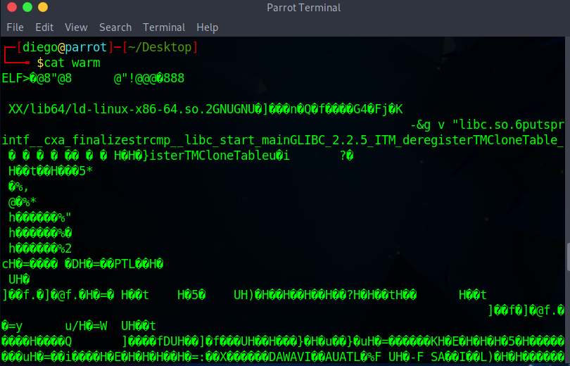
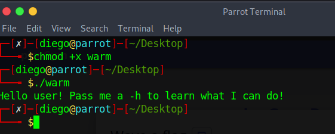

# Wave a flag

## Descripción
Can you invoke help flags for a tool or binary? [This program](https://mercury.picoctf.net/static/a00f554b16385d9970dae424f66ee1ab/warm) has extraordinarily helpful information...

## Resolución
Nos descargamos el programa proporcionado, llamado ‘warm’, al ser un archivo binario, el comando $cat no nos podrá dar ninguna información.

Le daremos permisos de ejecución y veremos qué hace:

Cuando lo ejecutamos con la flag -h nos dará el siguiente mensaje:

Y con esto estará resuelto el CTF, obteniendo la flag 'picoCTF{b1scu1ts_4nd_gr4vy_18788aaa}'.