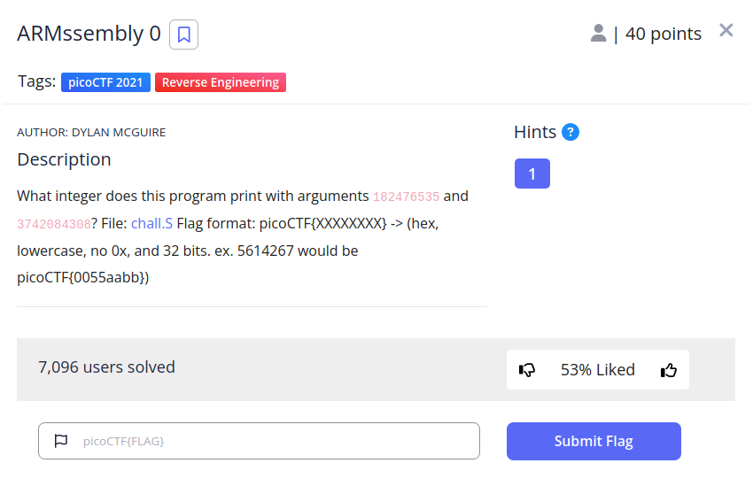
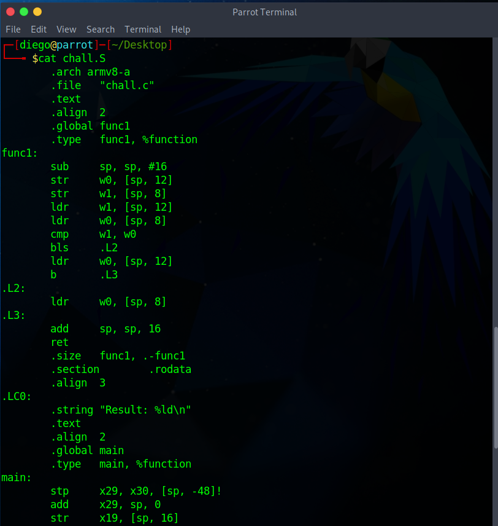
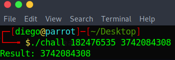
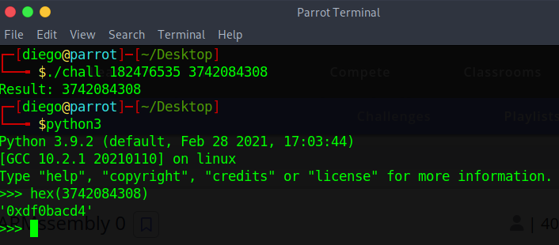

# ARMssembly 0

## Descripción
What integer does this program print with arguments 182476535 and 3742084308? File: [chall.S](https://mercury.picoctf.net/static/39820b71cabc14033bca1f2db00a6801/chall.S) Flag format: picoCTF{XXXXXXXX} -> (hex, lowercase, no 0x, and 32 bits. ex. 5614267 would be picoCTF{0055aabb})

## Resolución
Este CTF nos proporciona un archivo llamado chall.S con código en lenguaje ensamblador de ARM:

Para poder compilar este código en una máquina x64 necesitaremos un compilador y emulador de código especial. Instalaremos el compilador con los siguientes comandos:

`sudo apt install binutils-aarch64-linux-gnu`

`sudo apt-get install gcc-aarch64-linux-gnu`

Compilaremos con `aarch64-linux-gnu-as -o chall.o chall.s`

Y `aarch64-linux-gnu-gcc -static -o chall chall.o`

Para ejecutar el código, instalaremos quemu con `sudo apt install qemu-user-static`

Y podremos ejecutar el archivo como siempre:

Para convertir la flag al formato necesario podemos usar python:

Le quitamos el 0x, añadimos picoCTF{} y obtendremos la flag.

Nota: Más sobre el compilador y emulador se puede encontrar en https://github.com/joebobmiles/ARMv8ViaLinuxCommandline