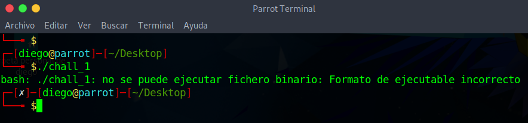

# ARMssembly 1


## Descripción
For what argument does this program print `win` with variables 79, 7 and 3? File: [chall_1.S](https://mercury.picoctf.net/static/eee77057c05086ff8bc47748cb1657ff/chall_1.S) Flag format: picoCTF{XXXXXXXX} -> (hex, lowercase, no 0x, and 32 bits. ex. 5614267 would be picoCTF{0055aabb})

## Resolución
Gracias al [anterior CTF de ARM](https://github.com/Diego-san-2000/PicoCTF_2021/tree/main/Reverse%20Engineering/ARMssembly%200), tenemos instalado lo necesario para compilar y correr el archivo chall_1.S. Sin embargo, esta vez no nos dejará ejecutar el archivo:



Analizaremos el código poco a poco:

```
.arch armv8-a  
.file «chall_1.c»  
.text  
.align 2  
.global func  
.type func, %function  
func:  
sub sp, sp, #32 #Reserva espacio al reduciir el puntero de pila  
str w0, [sp, 12] #Guarda el valor de w0 (argumento) en la posición sp + 12 de la pila  
mov w0, 79 #Almacena 79 en w0  
str w0, [sp, 16] #Guarda 79 en la posición sp + 16 de la pila  
mov w0, 7 #Mueve el valor 7 a w0  
str w0, [sp, 20] #Guarda 7 en la posición sp + 20 de la pila  
mov w0, 3 # Mueve 3 a w0  
str w0, [sp, 24] #Guarda el 3 en la posición sp + 24 de la pila  
ldr w0, [sp, 20] #Carga el 7 en w0  
ldr w1, [sp, 16] #Carga el 79 en w1  
lsl w0, w1, w0 #Desplaza a la izquierda el valor de w1 por w0 y lo guarda en w0  
str w0, [sp, 28] #Guarda 10112 en sp + 28  
ldr w1, [sp, 28] #Carga 10112 en w1  
ldr w0, [sp, 24] #Carga 3 en w0  
sdiv w0, w1, w0 #Divide w1 entre w0 y lo guarda en w0  
str w0, [sp, 28] #Guarda 3370 en sp + 28  
ldr w1, [sp, 28] #Carga 3370 en w1  
ldr w0, [sp, 12] #Carga el argumento en w0  
sub w0, w1, w0 #Resta w0 – w1 y lo guarda en w0  
str w0, [sp, 28] #Guarda el valor de w0 en sp + 28  
ldr w0, [sp, 28] #Carga sp + 28 en w0  
add sp, sp, 32 #Restaura el puntero de la pila  
ret #Retorna la función  
.size func, .-func  
.section .rodata  
.align 3  
.LC0: #Esta es a la función que tenemos que llegar  
.string «You win!»  
.align 3  
.LC1:  
.string «You Lose :(«  
.text  
.align 2  
.global main  
.type main, %function    
main:  
stp x29, x30, [sp, -48]!  
add x29, sp, 0  
str w0, [x29, 28]  
str x1, [x29, 16]  
ldr x0, [x29, 16]  
add x0, x0, 8  
ldr x0, [x0]  
bl atoi  
str w0, [x29, 44]  
ldr w0, [x29, 44]  
bl func #Ejecutamos fucn con w0 como argumento  
cmp w0, 0 #Aquí se compara si w0 es igual a 0  
bne .L4 #Si la comprobación es cierta, vamos a L4  
adrp x0, .LC0 #Cargamos LC0  
add x0, x0, :lo12:.LC0 #Vamos a LC0  
bl puts  
b .L6  
.L4:  
adrp x0, .LC1 #Cargamos LC1  
add x0, x0, :lo12:.LC1 #Vamos a LC1  
bl puts  
.L6:  
nop  
ldp x29, x30, [sp], 48  
ret  
.size main, .-main  
.ident «GCC: (Ubuntu/Linaro 7.5.0-3ubuntu1~18.04) 7.5.0»  
.section .note.GNU-stack,»»,@progbits
```

Hay mucho lío, pero el programa realiza las siguientes funciones:

1. El número 79 se almacena en w0
2. Se desplaza 79 a la izquierda 7 veces (79 << 7) = 10112
3. Se divide el número entre 3: 3370
4. A ese número le resta el argumento, si es 0 se llegará a la función que imprime el mensaje de Win.

Tenemos que convertir 3370 en hexadecimal (0xd2a), quitarle el ‘0x’ y añadirle tantos 0s por la izquierda como sea necsario para hacerlo de 32 bits. El resultado es la siguiente flag: picoCTF{00000d2a}
