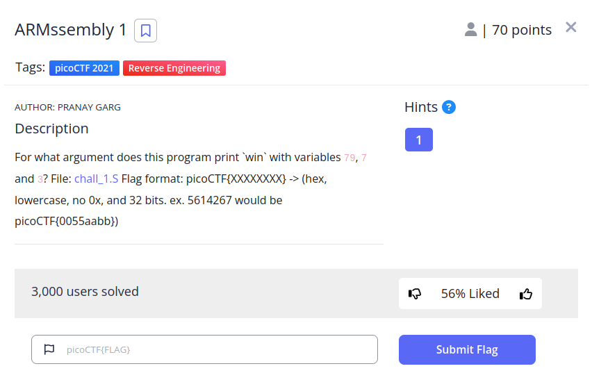

# ARMssembly 1

## Descripción
For what argument does this program print `win` with variables 79, 7 and 3? File: [chall_1.S](https://mercury.picoctf.net/static/eee77057c05086ff8bc47748cb1657ff/chall_1.S) Flag format: picoCTF{XXXXXXXX} -> (hex, lowercase, no 0x, and 32 bits. ex. 5614267 would be picoCTF{0055aabb})

## Resolución
Gracias al anterior CTF de ARM, tenemos instalado lo necesario para compilar y correr el archivo chall_1.S. Sin embargo, esta vez no nos dejará ejecutar el archivo: