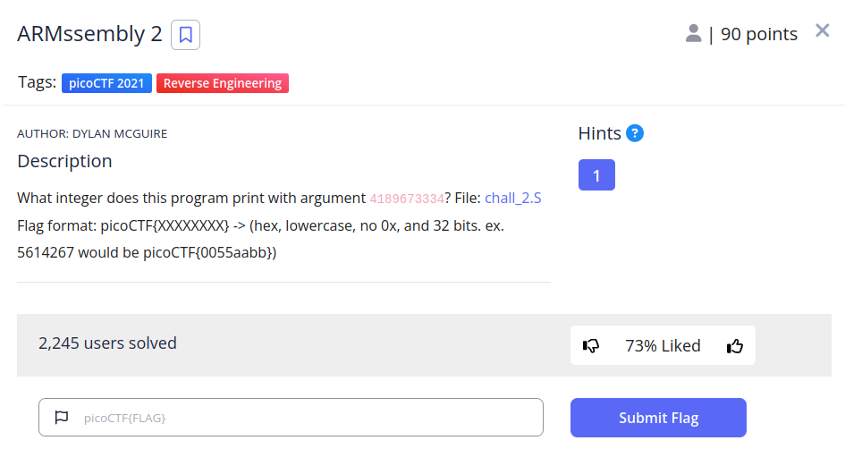

# ARMssembly 2


## Descripción
What integer does this program print with argument 4189673334? File: [chall_2.S](https://mercury.picoctf.net/static/5c0f1b8d9f0656c228ea0adb62cd5fbf/chall_2.S) Flag format: picoCTF{XXXXXXXX} -> (hex, lowercase, no 0x, and 32 bits. ex. 5614267 would be picoCTF{0055aabb})

## Resolucion
Nos proporcionan el siguiente código ARM:

```
	.arch armv8-a #Arquitecctura ARMv8-A
	.file	"chall_2.c" #Nombre del archivo fuente original
	.text #Indica que a continuación hay instrucciones
	.align	2 #La dirección de memoria comienza en un múltiplo de 2
	.global	func1 #func1 es una función globar, se le puede llamar de otros módulos
	.type	func1, %function #Se define func1 como función
func1:
	sub	sp, sp, #32 #Reserva 32 bytes de memoria
	str	w0, [sp, 12] #Guarda el valor de w0 en 12 offset
	str	wzr, [sp, 24] #Se guarda 0 en 24 offset
	str	wzr, [sp, 28] #Se guarda 0 en 28 offset
	b	.L2 #Se ejecuta L2
.L3:
	ldr	w0, [sp, 24] #Se carga en w0 el offset 24
	add	w0, w0, 3 #Se le suma 3 al valor
	str	w0, [sp, 24] #Se guarda w0 en el offset 24
	ldr	w0, [sp, 28] #Se carga en w0 el offset 28 
	add	w0, w0, 1 #Se le suma 1 al valor
	str	w0, [sp, 28] #Se guarda w0 en el offset 28
.L2:
	ldr	w1, [sp, 28] #Se carga en w1 el offset 28
	ldr	w0, [sp, 12] #Se carga en w0 el offset 12
	cmp	w1, w0 #Comparamos w1 con w0
	bcc	.L3 #Si w0 es menor, saltamos a L3
	ldr	w0, [sp, 24] #Cargamos en w0 el offset 24
	add	sp, sp, 32 #Liberamos espacio en la pila
	ret #Liberamos espacio en la pila
	.size	func1, .-func1
	.section	.rodata
	.align	3
.LC0:
	.string	"Result: %ld\n"
	.text
	.align	2
	.global	main
	.type	main, %function
main: #Inicio de la función principal
	stp	x29, x30, [sp, -48]! #Se ajusta la dirección de la pila
	add	x29, sp, 0 #Se ajusta la dirección de la pila
	str	w0, [x29, 28] #Se almacena lo pasado a la función
	str	x1, [x29, 16] #Se almacena lo pasado a la función
	ldr	x0, [x29, 16] #Carga el valor del parámetro
	add	x0, x0, 8 #Suma 8 al valor
	ldr	x0, [x0] #Carga el valor almacenado en la dirección calculada en el paso anterior
	bl	atoi #Se llama a atoi
	bl	func1 #Se llama a func1
	str	w0, [x29, 44] #Se guarda el resultado de func1
	adrp	x0, .LC0 
	add	x0, x0, :lo12:.LC0
	ldr	w1, [x29, 44]
	bl	printf #Se imprime por pantalla
	nop
	ldp	x29, x30, [sp], 48
	ret
	.size	main, .-main
	.ident	"GCC: (Ubuntu/Linaro 7.5.0-3ubuntu1~18.04) 7.5.0"
	.section	.note.GNU-stack,"",@progbits

```

Este código realiza lo siguiente:
1. Toma el valor introducido y lo almacena en stack+12
2. Guarda 0 en stack+24 y stack+28
3. Compara stack+28 con stack+12, si stack+12 es menor se repite L3

Si se repite L3, se le suma 3 a stack+12 y 1 a stack+28

Cuando no se repita L3, se imprimirá por pantalla el resultado, que es el número proporcionado después de pasar por el bucle (y sumarle 1) todas las veces que sea necesario.

Si lo examinamos detenidamente, lo que se está haciendo es multiplicar por tres:

1. Se compara el primer parámetro con x
2. Se suma 1 a x
3. Se suma 3 al parámetro
4. Se compara el primer parámetro con x

Se suma al número 3 tantas veces como unidades halla, con esto podemos multiplicar el parámetro por 3 y realizar las operaciones necesarias para que la flag sea aceptada:

```
n = 4189673334*3
restultado = int(hex(n),16) & 0xffffffff
print(f'{restultado:08x}')
```

Obteniendo como resultado: ed2c0662

Y como flag: 'picoCTF{ed2c0662}'