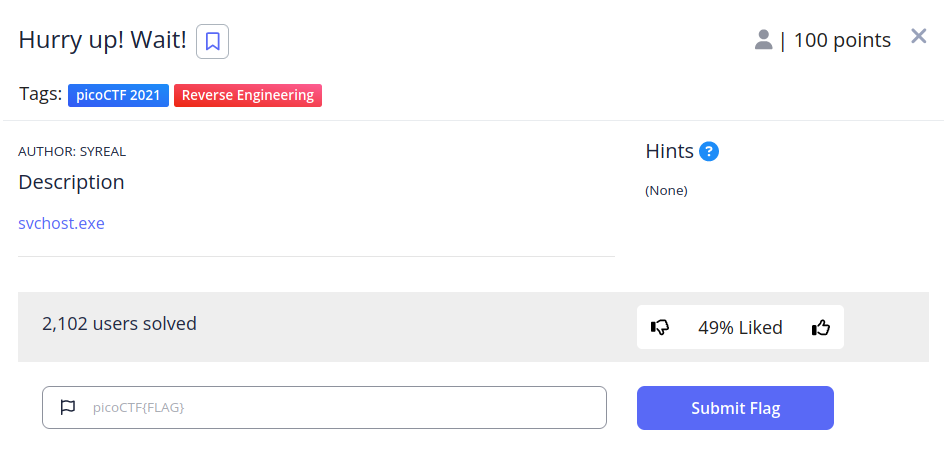
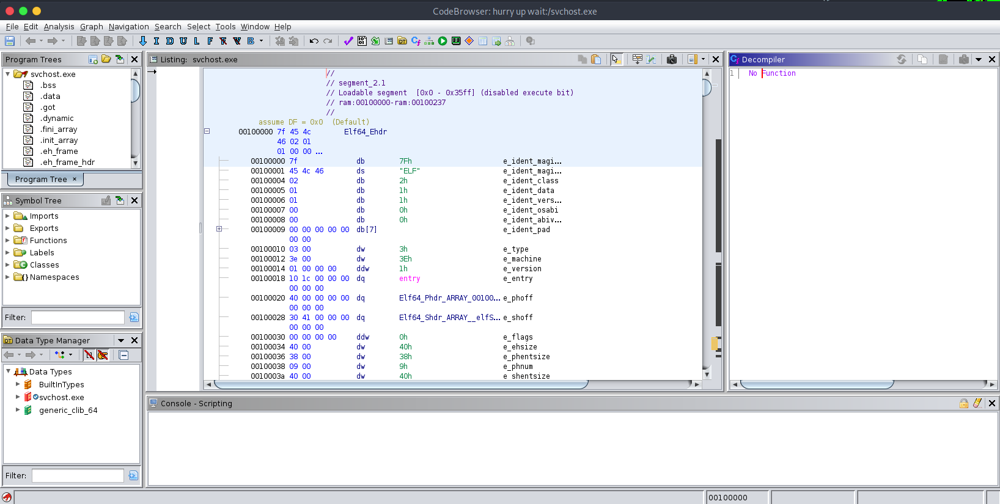
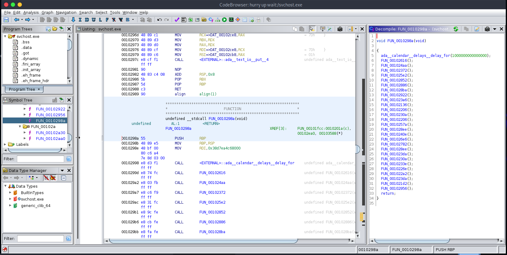
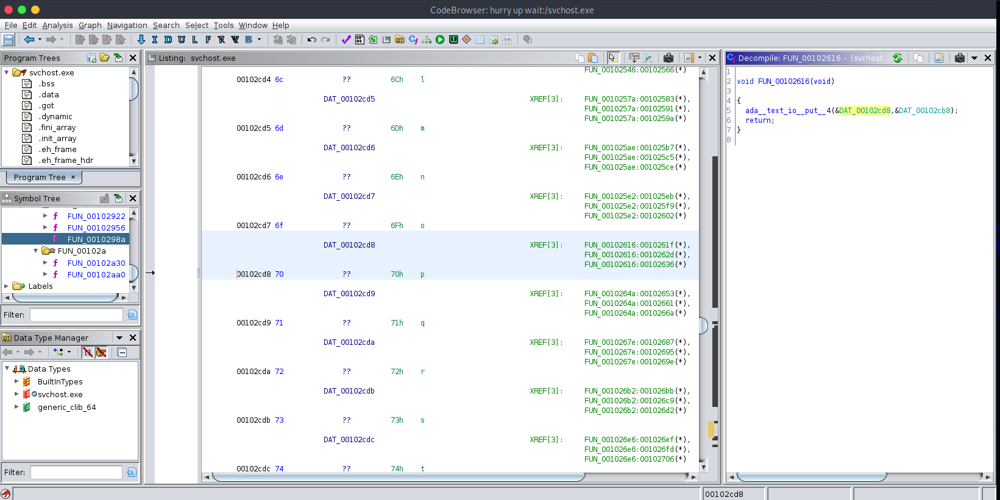
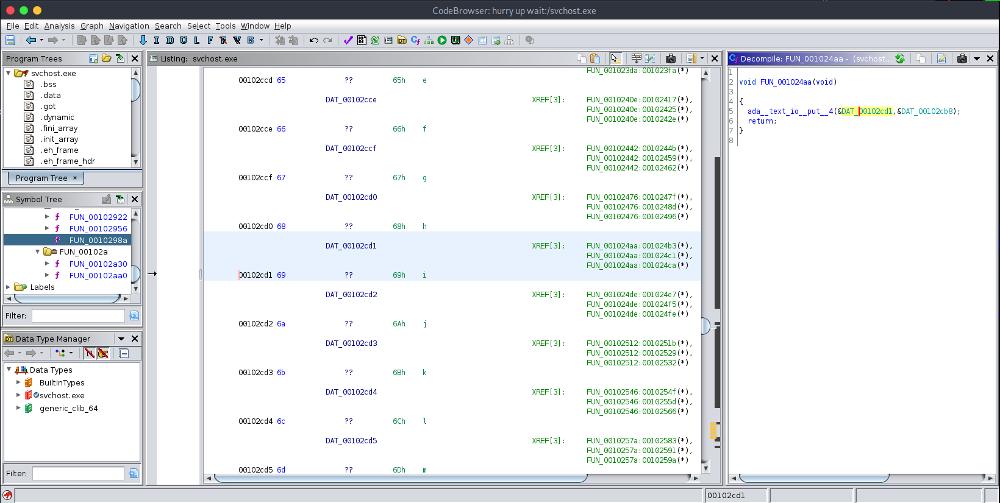

# Hurry up! Wait!

## Descripción
[svchost.exe](https://mercury.picoctf.net/static/af4d1c8dce72f8f7b55350f16ab8e3a2/svchost.exe)

## Resolucion
Descargamos el programa, creamos un nuevo proyecto con ghidra y lo analizamos:

Esta es la función que más interesante parece:

Si examinamos la primera llamada, vemos que inprime por pantalla una p:

Vemos que la segunda llamada imprime por pantalla una i, como el inicio de una flag:

Si anotamos la salida de todas las funciones obtendremos la flag: 'picoCTF{d15a5m_ftw_eab78e4}'.