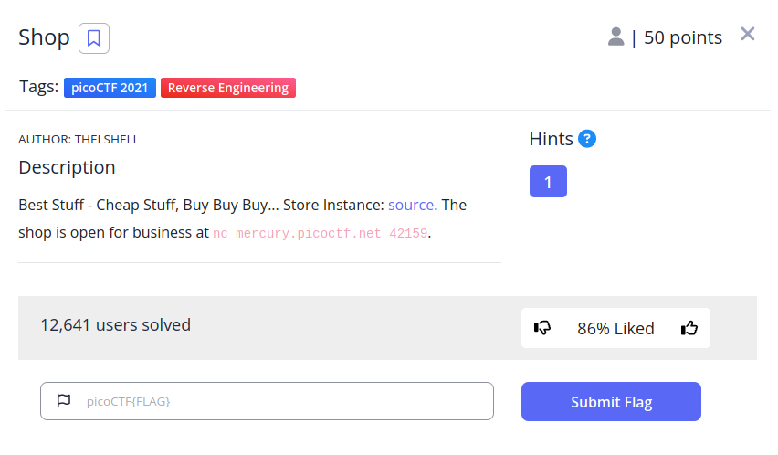
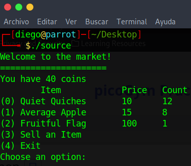
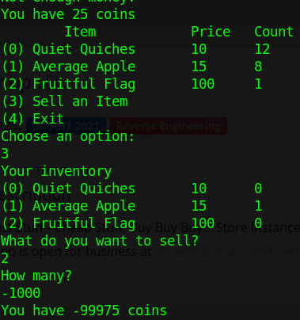
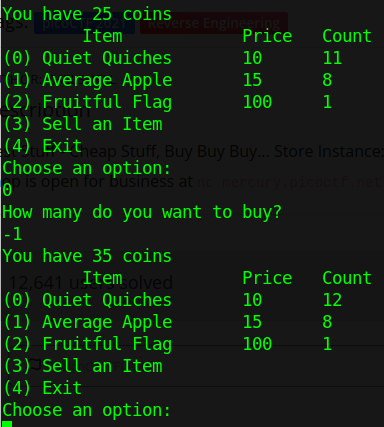
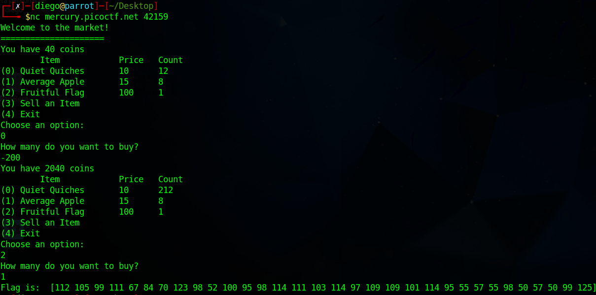
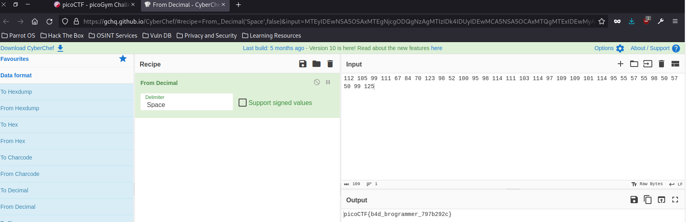

En este caso, nos dan un archivo compilado llamado ‘source’ al cual le tendremos que dar permisos de ejecución ($ chmod +x source) para poder abrir.

También nos proporcionan un enlace al servidor donde está el programa corriendo.

Al ejecutar el programa nos encontraremos con el siguiente menú:  

Si introducimos un número negativo, podremos acabar teniendo dinero negativo:  

Sabiendo que el programa acepta números negativos, si compramos un número negativo de frutas nuestro dinero aumentará (- cantidad * – coste = + dinero):  

Una vez que descubrimos esto, lo podemos comprobar en el servidor para obtener la flag: 

Pegamos el resultado en [cybercheff](https://gchq.github.io/CyberChef/) con la opción ‘From Decimal’ y obtenemos la flag:  
