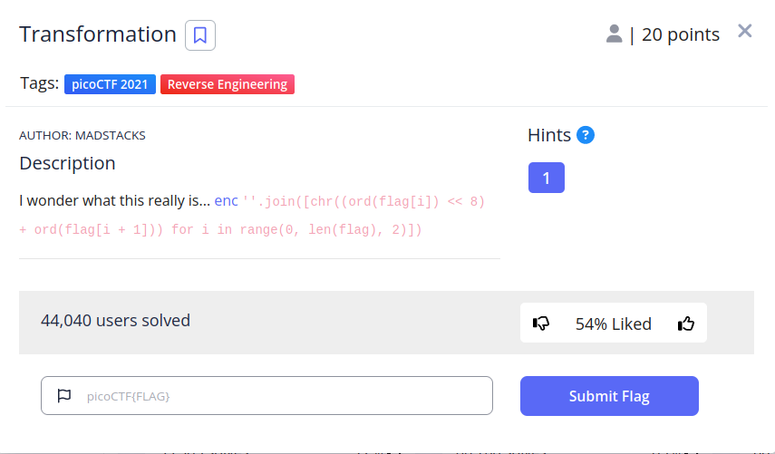
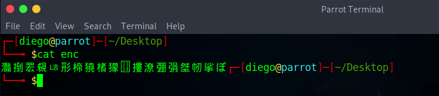
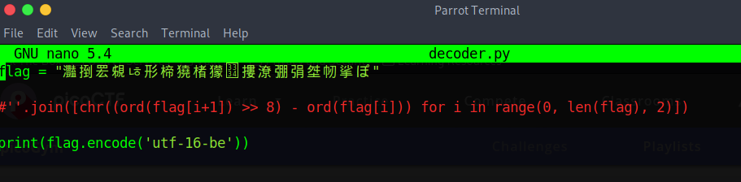
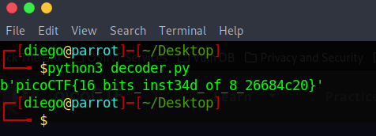

# Transformation


## Descripción
I wonder what this really is... [enc](https://mercury.picoctf.net/static/0d3145dafdc4fbcf01891912eb6c0968/enc)
```
''.join([chr((ord(flag[i]) << 8) + ord(flag[i + 1])) for i in range(0, len(flag), 2)])

```

## Resolución
El CTF nos proporciona un archivo 'enc' y un fragmento de código de python. El archivo 'enc' tiene el siguiente contenido:



Primero, tenemos que entender lo que está haciendo el código de python que nos han proporcionado:

Tiene un bucle que coge de la cadena de caracteres 'flag' los caracteres de dos en dos. Estos caracteres los convierte a ASCII y, al primer carácter, le desplaza a la izquierda 8 posiciones sus bits, para luego sumarle el segundo carácter. La función chr() convierte la cadena resultante en un nuevo carácter y join() une todos los caracteres.

Como resultado, la codificación que era de 8 bits, ha pasado a ser de 16 bits, teniendo en cada carácter información de dos caracteres.

Para resolverlo, tenemos que hacer un script en python que devuelva la cadena de caracteres a una codificación de 8 bits (UTF-8) o que interprete la cadena de caracteres como UTF-16, esta segunda es más fácil:





La codificación utilizada es UTF de 16 bits en «Big Endian» (es decir, el bit mayor es el izquierdo). Con esto obtenemos la flag 'picoCTF{16_bits_inst3ad_of_8_26684c20}'.