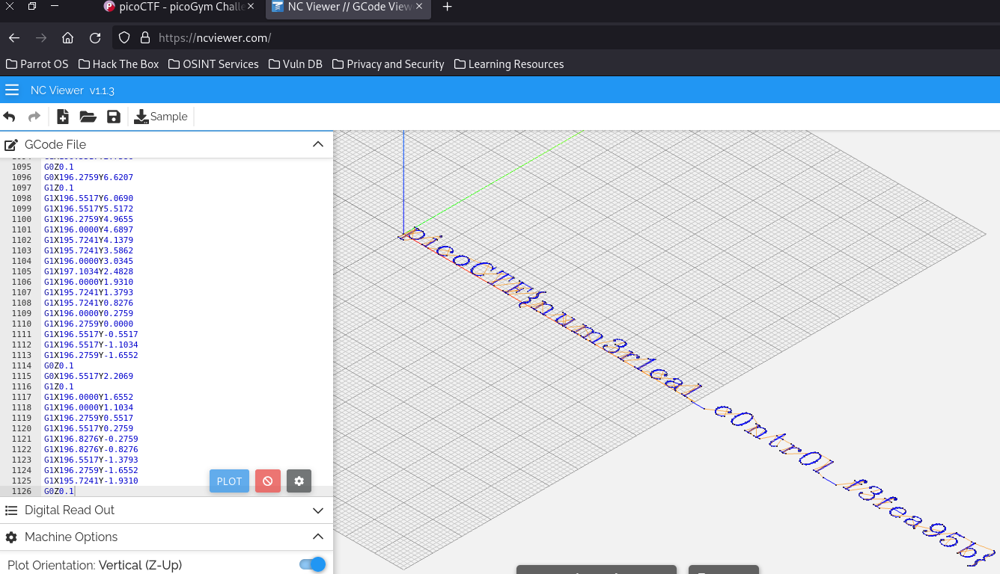

# speeds and feeds

## Descripción
There is something on my shop network running at nc mercury.picoctf.net 59953, but I can't tell what it is. Can you?

## Resolución
Nos conectamos por netcat a la máquina y obtenemos el siguiente resultado:

Buscar con grep «pico» no nos servirá de nada.

Una búsqueda en internet nos dice que es código G-Code, de un programa escrito en lenguaje de control numérico computarizado (CNC). Estos programas tienen como extensión .NC, .CNC o .GCO, pero no será necesario probar extensiones ni instalar nada, ya que hay visores online de este tipo de código, como es [NC Viewer](https://ncviewer.com/)

Pegamos el código, pulsamos ‘plot’ y podremos ver la flag:

