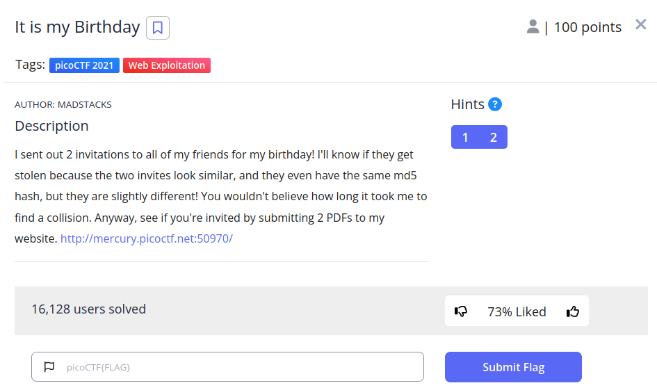
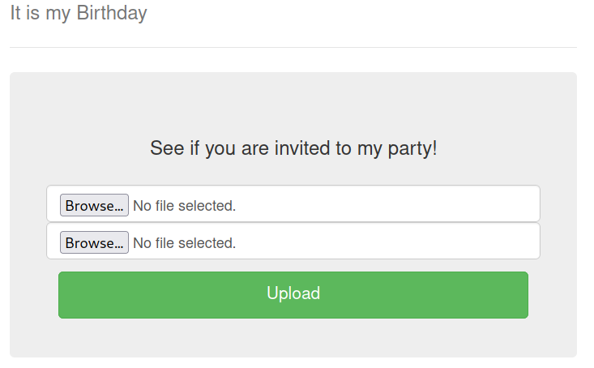
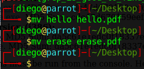
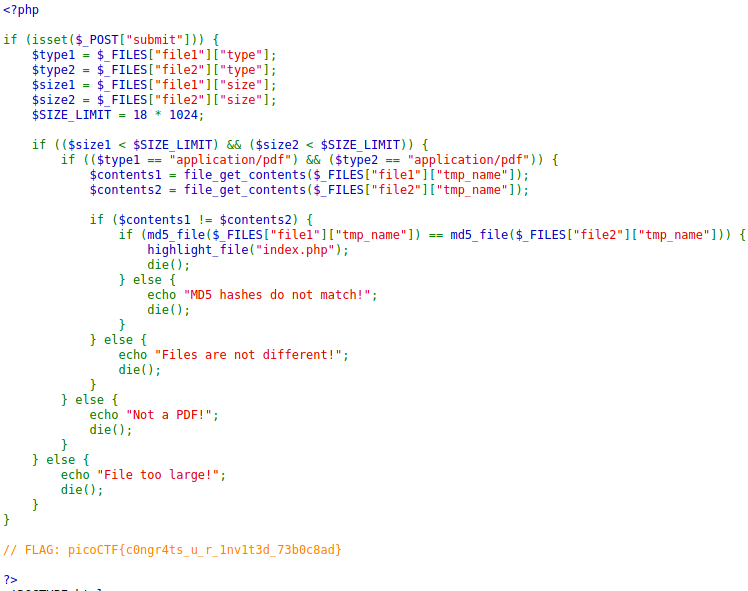

# Wireshark twoo twooo two twoo... writeup

## Descripción
I sent out 2 invitations to all of my friends for my birthday! I'll know if they get stolen because the two invites look similar, and they even have the same md5 hash, but they are slightly different! You wouldn't believe how long it took me to find a collision. Anyway, see if you're invited by submitting 2 PDFs to my website. [http://mercury.picoctf.net:50970/](http://mercury.picoctf.net:50970/).

## Resolución
La página de este CTF tiene el siguiente aspecto:

En el código fuente de esta no hay nada que nos pueda dar una pista, sin embargo el enunciado nos dice que tenemos que proporcionar dos archivos .pdf con el mismo hash MD5.

MD5 era un antiguo método de hasheo que se dejó de utilizar por la facilidad de obtener colisiones.

Una colisión ocurre cuando dos archivos distintos generan el mismo hash.

Buscando en internet, encontraremos [esta página web](https://www.mscs.dal.ca/~selinger/md5collision/) que nos proporciona ejemplos que generan colisiones.

Nos descargamos los archivos, pero no están en formato .pdf, así que los cambiamos con comandos:

Subimos los archivos y obtenemos el siguiente texto:

Consiguiendo así la flag ‘picoCTF{c0ngr4ts_u_r_1nv1t3d_73b0c8ad}’.

