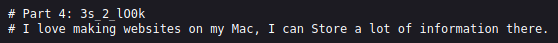

# Scavenger Hunt

## Descripción
There is some interesting information hidden around this site [http://mercury.picoctf.net:39491/](http://mercury.picoctf.net:39491/). Can you find it?

## Resolucion
En este CTF nos dan el enlace a una web que se ve así:

Mirando con Ctrl+U el código fuente, encontramos el primer trozo de la flag:

Examinamos el archivo de estilos .css para buscar más información:

Y continuamos con el archivo de javascript, que no tiene más fragmentos pero sí una pista:

/* ¿Cómo evito que Google indexe mi sitio web? */

Los motores de búsqueda acuden a dos archivos para rastrear las páginas web:

- robots.txt: Indica a los motores de búsqueda a qué URLs pueden acceder.
- sitemap.xml: Contiene una lista de todas las páginas indexadas de la web.

Buscamos en view-source:[http://mercury.picoctf.net:39491/robots.txt](http://mercury.picoctf.net:39491/robots.txt) y encontramos más información:

\# Creo que es un servidor apache… ¿puedes Acceder a la siguiente flag?

Los servidores apache tienen un archivo .htaccess con información sobre redirecciones y protocolo https, entramos en [view-source:http://mercury.picoctf.net:39491/.htaccess](view-source:http://mercury.picoctf.net:39491/.htaccess) y encontramos la siguiente pista:

\# Me gusta hacer sitios web en mi Mac, puedo Almacenar mucha información ahí.

En los sistemas operativos Mac, existe un tipo de archivo especial .DS_Store que guarda la configuración de la carpeta, vamos a ponerlo en el enlace por si diera resultado [view-source:http://mercury.picoctf.net:39491/.DS_Store](view-source:http://mercury.picoctf.net:39491/.DS_Store):

Con esto obtenemos la flag: 'picoCTF{th4ts_4_l0t_0f_pl4c3s_2_lO0k_f7ce8828}'