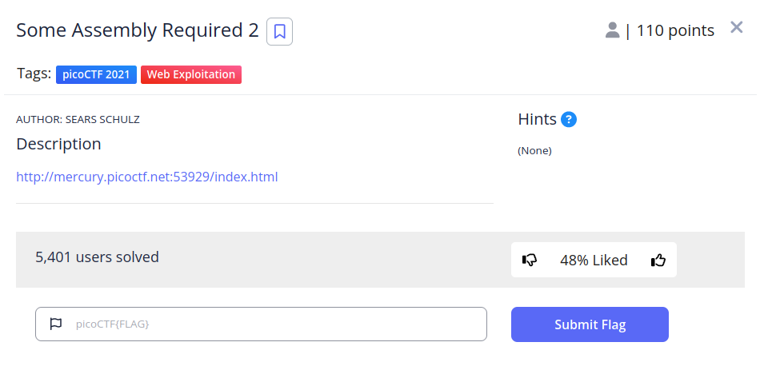
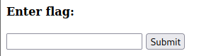
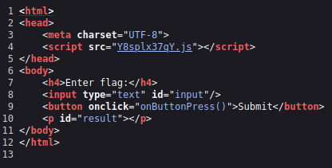
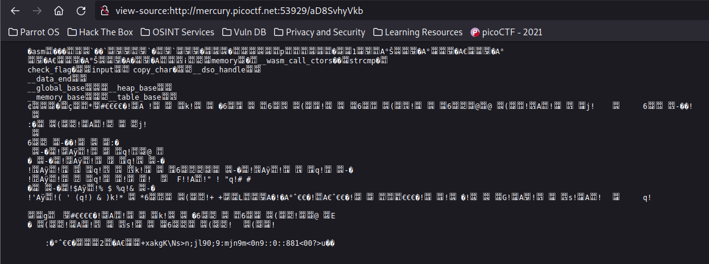
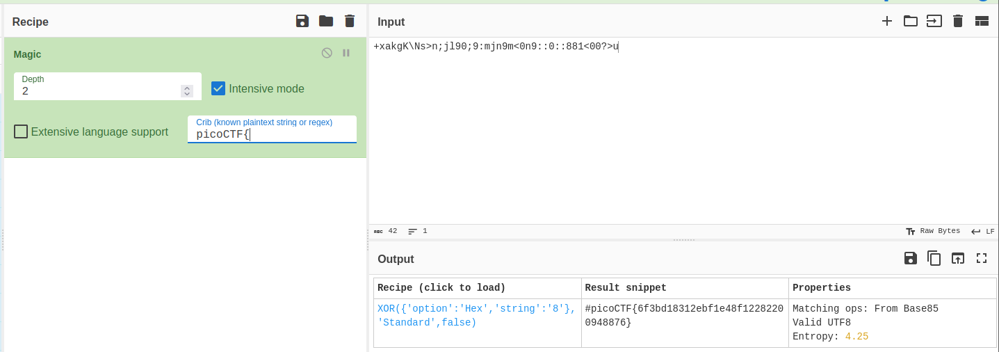

# Some Assembly Required 2


## Descripción
[http://mercury.picoctf.net:53929/index.html](http://mercury.picoctf.net:53929/index.html)

## Resolucion
Nos dan un enlace a la siguiente página:



Si examinamos el código fuente de la página, nos volveremos a encontrar con un archivo javascript:



```
const _0x6d8f=['copy_char','value','207aLjBod','1301420SaUSqf','233ZRpipt','2224QffgXU','check_flag','408533hsoVYx','instance','278338GVFUrH','Correct!','549933ZVjkwI','innerHTML','charCodeAt','./aD8SvhyVkb','result','977AzKzwq','Incorrect!','exports','length','getElementById','1jIrMBu','input','615361geljRK'];const _0x5c00=function(_0x58505a,_0x4d6e6c){_0x58505a=_0x58505a-0xc3;let _0x6d8fc4=_0x6d8f[_0x58505a];return _0x6d8fc4;};(function(_0x12fd07,_0x4e9d05){const _0x4f7b75=_0x5c00;while(!![]){try{const _0x1bb902=-parseInt(_0x4f7b75(0xc8))*-parseInt(_0x4f7b75(0xc9))+-parseInt(_0x4f7b75(0xcd))+parseInt(_0x4f7b75(0xcf))+parseInt(_0x4f7b75(0xc3))+-parseInt(_0x4f7b75(0xc6))*parseInt(_0x4f7b75(0xd4))+parseInt(_0x4f7b75(0xcb))+-parseInt(_0x4f7b75(0xd9))*parseInt(_0x4f7b75(0xc7));if(_0x1bb902===_0x4e9d05)break;else _0x12fd07['push'](_0x12fd07['shift']());}catch(_0x4f8a){_0x12fd07['push'](_0x12fd07['shift']());}}}(_0x6d8f,0x4bb06));let exports;(async()=>{const _0x835967=_0x5c00;let _0x1adb5f=await fetch(_0x835967(0xd2)),_0x355961=await WebAssembly['instantiate'](await _0x1adb5f['arrayBuffer']()),_0x5c0ffa=_0x355961[_0x835967(0xcc)];exports=_0x5c0ffa[_0x835967(0xd6)];})();function onButtonPress(){const _0x50ea62=_0x5c00;let _0x5f4170=document[_0x50ea62(0xd8)](_0x50ea62(0xda))[_0x50ea62(0xc5)];for(let _0x19d3ca=0x0;_0x19d3ca<_0x5f4170['length'];_0x19d3ca++){exports[_0x50ea62(0xc4)](_0x5f4170[_0x50ea62(0xd1)](_0x19d3ca),_0x19d3ca);}exports['copy_char'](0x0,_0x5f4170[_0x50ea62(0xd7)]),exports[_0x50ea62(0xca)]()==0x1?document['getElementById'](_0x50ea62(0xd3))[_0x50ea62(0xd0)]=_0x50ea62(0xce):document[_0x50ea62(0xd8)](_0x50ea62(0xd3))['innerHTML']=_0x50ea62(0xd5);}
```

De nuevo, volvemos a encontrar algo que podría ser una ruta: './aD8SvhyVkb'. Por lo que entramos en [view-source:http://mercury.picoctf.net:53929/aD8SvhyVkb](view-source:http://mercury.picoctf.net:53929/aD8SvhyVkb)



Vemos que hay referencias a WASM (Web Assembly) y una función llamada checkflag.

Tomamos el fragmento legible del código y nos lo llevamos a [cybercheff](https://gchq.github.io/CyberChef/):

Con la opción 'Magic' averiguaremos que la operación que se realiza a la flag es un XOR para codificarla.



Obteniendo así la flag: 'picoCTF{6f3bd18312ebf1e48f12282200948876}'