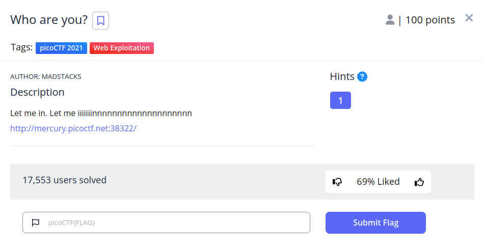
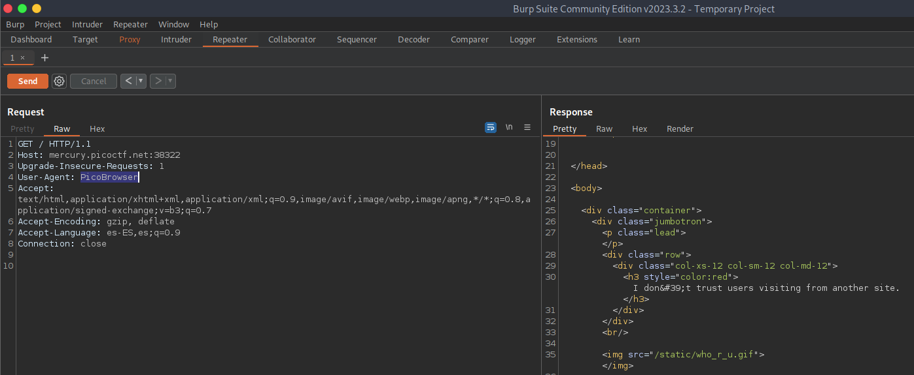

# Who are you? writeup

## Descripción
Let me in. Let me iiiiiiinnnnnnnnnnnnnnnnnnnn [http://mercury.picoctf.net:38322/](http://mercury.picoctf.net:38322/)

## Resolucion
Nos dan un enlace a la siguiente página:

Nos dicen que solo pueden entrar al sitio web las personas que utilicen el ‘PicoBrowser’. Para poder modificar nuestra petición y usar ese navegador usaremos BurpSuite:

Entramos en Proxy, abrimos el navegador e insertamos la URL. Una vez nos aparezca, en BurpSuite, hacemos click derecho y lo enviamos al repetidor.

Cambiamos de la cabecera HTTP la opción ‘User-Agent’ para emular el navegador ficticio que nos están pidiendo. Al hacerlo cambia el mensaje:

‘I don’t trust users visiting from another site.’

Añadimos la cabecera ‘Referer’, que indica de qué página venimos.

Al hacer esto nos dan un mensaje diciendo que la página solo funcionaba en 2018. Por lo que añadimos la cabecera ‘Date’ con el valor del 1 de enero de 2018:

Ahora nos dice que no confía en usuarios que pueden ser seguidos, lo que hace referencia a la cabecera ‘DNT’ (Do Not Track)

Nos dice que la página es solo para gente de Suecia, por lo que deberemos usar la cabecera ‘X-Forwarded-For’ junto con una ip de Suecia

La respuesta a este cambio es: «You’re in Sweden but you don’t speak Swedish». Añadimos la cabecera ‘Accept-Language: sv’:

Obteniendo así la flag: ‘picoCTF{http_h34d3rs_v3ry_c0Ol_much_w0w_b22d773c}’